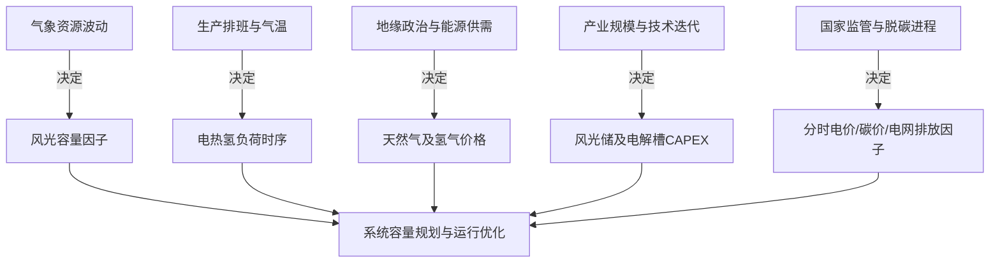

# 零碳园区综合能源系统优化模型 - 数据来源与合理性汇总

本项目致力于构建**电-热-氢-储协同优化、容量规划、风险防御（随机与鲁棒规划）**的综合能源系统（IES）。为使模型输出具备工程解释力，项目在第一次数据更新中对数据参数进行了全面补齐与重构。本文档对当前模型所使用的全部数据、来源、影响因素及数据选取合理性进行系统性汇总。

---

## 一、 数据体系与推荐参数汇总

本模型所使用的数据可分为五大类：**时序负荷与资源数据**、**设备技术参数**、**经济与市场参数**、**排放与政策参数**以及**可靠性与不确定性参数**。所有数据都可通过 [loader.py](file:///e:/clean_engry_system/src/zero_carbon_park/data/loader.py) 进行读取，数据源主要来自 [build_codex_data_workbook.py](file:///e:/clean_engry_system/scripts/build_codex_data_workbook.py) 构建的 Excel 数据表。

### 1. 时序负荷与资源数据 (TimeSeries)
数据时间跨度为 2024 年全年逐时（8784小时），并提取了夏季、冬季、过渡季三个典型日（72小时）用于规划求解。

| 数据名称 | 推荐值/范围 | 单位 | 数据生成与重构方法 | 来源/依据 |
| :--- | :--- | :--- | :--- | :--- |
| **园区电负荷** | 峰值约 150 MW 年电量约 1.2 TWh | kW | 基于三班制重工业园区负荷曲线重构：白天（8-18点）系数 1.07，傍晚（18-23点）系数 1.03，深夜（0-5点）系数 0.93。夏季系数 1.03，冬季 0.99。 | 结合 Surbana Jurong 鄂尔多斯零碳园案例与 Frontiers in Energy Research 论文尺度校准 |
| **园区热负荷** | 峰值约 112 MW 年热量约 0.8 TWh | kWth | 工业过程热基荷（62 MW） + 温度敏感性采暖负荷（$T_{2M} < 18^\circ\text{C}$ 时，每低 $1^\circ\text{C}$ 增加 1.9 MW） + 夏季热水负荷（6-8月增加 6 MW）。 | 基于鄂尔多斯气温数据与工业采暖逻辑重构 |
| **园区氢负荷** | 范围约 780 - 1100 kg/h | kg/h | 工业过程用氢基荷（960 kg/h） + 日间重卡物流交通用氢起伏（7-20点上浮 110 kg/h，夜间下浮 45 kg/h） + 季节性正弦波动。 | 结合中国氢能发展报告中内蒙古消纳场景重构 |
| **光伏容量因子 (pv_cf)** | 0 - 0.95 均值约 0.17 | - | 基于 NASA 逐时总辐照度（GHI）与气温推导，考虑系统综合效率 $PR=0.82$ 及组件温度修正（高于 $25^\circ\text{C}$ 按 $-0.4\%/^\circ\text{C}$ 修正）。 | NASA POWER Hourly API (纬度 39.61, 经度 109.78) |
| **风电容量因子 (wind_cf)** | 0 - 0.95 均值约 0.32 | - | 基于 NASA 50米逐时风速推导，切入/额定/切出风速分别设为 3 / 12 / 25 m/s，切入至额定段采用立方曲线模拟。 | NASA POWER Hourly API (鄂尔多斯代表点) |

### 2. 设备技术参数 (Device Parameters)
包含容量规划中各种能量转换与存储设备的投资成本、技术寿命及转化效率。

| 设备类别 | 设备名称 | 投资成本 (CAPEX) | 寿命 (Years) | 转换效率 (Efficiency/COP) | 来源与参考依据 |
| :--- | :--- | :--- | :---: | :--- | :--- |
| **新能源** | **风电机组** | 7,500 元/kW | 20 | 见 wind_cf 曲线 | IRENA 2024 可再生能源成本报告 (1041 USD/kW) |
| | **光伏系统** | 5,000 元/kW | 25 | 见 pv_cf 曲线 | IRENA 2024 可再生能源成本报告 (691 USD/kW) |
| **电储能** | **锂电池(能量)** | 1,000 元/kWh | 12 | 充电效率 0.95 放电效率 0.95 | CNESA 2024 储能白皮书 (中标价约 0.79 元/Wh) 及 IRENA 储能报告 |
| | **锂电池(功率)** | 800 元/kW | 12 | - | 行业 PCS 及配电 BOP 综合估算 |
| **氢能链路**| **碱性电解槽** | 2,200 元/kW | 15 | 耗电量：55 kWh/kgH₂ （最小负荷率 15%） | US DOE / IRENA 绿氢降本报告目标值 |
| | **储氢罐** | 3,600 元/kg | 20 | 日损耗率：0.1% (液氢/高压) | 氢能储输技术与成本文献 (高压气态与低温液态折中) |
| | **PEM燃料电池** | 6,000 元/kW | 10 | 发电效率：18.5 kWh/kgH₂ （最小负荷率 20%） | US DOE 2023 重卡氢燃料电池系统成本目标折算 |
| **热能链路**| **空气源热泵** | 3,500 元/kWth | 15 | 基准 COP = 3.5 （冬季下修至 2.6，夏季 4.0）| IRENA 商业热泵成本与 IEA 热泵报告折算 |
| | **燃气锅炉** | 500 元/kWth | 15 | 锅炉热效率：87% | IEA 工业热源效率标准与工程造价假设 |

> [!NOTE]
> 设备年化投资成本（Annualized Capital Cost）计算中，项目统一采用 **6%** 的折现率（Discount Rate）进行等额本息折算。

### 3. 经济与市场参数 (Economic Parameters)
用于描述系统与外部能源市场的交互成本与价格体系。

*   **购电分时电价 (TOU Price)**：基于内蒙古西部电网（蒙西电网）工商业分时电价政策。以平段电价 **0.45 元/kWh** 为建模基准：
    *   **大风季（1-5, 9-12月）**：峰时（06-08, 18-22点）上浮 68%（**0.756 元/kWh**）；谷时（00-04, 11-16点）下浮 52%（**0.216 元/kWh**）；平时为 **0.45 元/kWh**。
    *   **小风季（6-8月）**：峰时上浮 54%（**0.693 元/kWh**）；谷时下浮 56%（**0.198 元/kWh**）；平时为 **0.45 元/kWh**。引入**尖峰电价**（19-21点，峰上浮20%：**0.8316 元/kWh**）与**深谷电价**（13-15点，谷下浮20%：**0.1584 元/kWh**）。
*   **需量电费 (Demand Charge)**：32.8 元/kW·月（对应大工业两部制电价），折合年化为 **393.6 元/kW·年**。
*   **余电上网价格**：**0.2829 元/kWh**（蒙西电网燃煤基准上网电价）。
*   **外购天然气价格**：**2.952 元/m³**（参考鄂尔多斯市发改委非居民管道天然气非采暖季销售价格）。
*   **外购氢价格 / 售氢价格**：外购氢兜底价 **48.6 元/kg**；售氢价格 **45.7 元/kg**（源自国家能源局《中国氢能发展报告(2025)》示范城市群消费侧价格）。

### 4. 碳排放与政策参数
*   **电网购电二氧化碳排放因子**：**0.6849 kgCO₂/kWh**（采用生态环境部/国家统计局最新公布的内蒙古省级电力平均排放因子）。
*   **天然气燃烧排放因子**：**2.16 kgCO₂/m³**（根据国家发改委《工业其他行业温室气体排放核算指南》，按低位发热量 $38.931\text{ MJ/m}^3$、单位热值含碳量 $15.3\text{ tC/TJ}$ 及 99% 碳氧化率推导）。
*   **碳排放交易价格 (Carbon Price)**：**62.36 元/tCO₂**（参考 2025 年全国碳排放权交易市场全年成交均价）。
*   **新能源最低利用率限制**：**90%**（响应国家能源局“新能源消纳利用率不低于90%”的红线政策）。

### 5. 可靠性与备用价值参数 (Backup & Reliability)
为量化燃料电池（FC）的应急保供价值而引入的参数：
*   **停电损失 (VOLL)**：**55.2 元/kWh**（折合 7.61 USD/kWh，参考 LBNL 工业停电损失文献综述）。
*   **年平均停电时间**：**2.0 小时/年**（园区电网供电可靠性常规假设）。
*   **燃料电池备用容量价值**：**300 元/kW·年**（由停电损失与柴油发电机替代成本年化值推导得出）。

---

## 二、 数据的影响因素分析

模型中所采用的各类数据并非静止不变，在实际工程中受多重物理与市场机制的动态影响：

### 1. 气象资源波动的随机性与季节性
*   **风光出力**：完全受每日天气（阴晴、风速）的影响。鄂尔多斯属于典型的温带大陆性季风气候，冬季风力强劲、光照时间短，夏季风力减弱、日照充沛。这导致风光容量因子在时间上存在极大的非对称性与不确定性。
*   **气温波动**：气温直接决定了热负荷。冬季极寒天气（可达 $-20^\circ\text{C}$ 以下）会使采暖热负荷飙升，同时导致空气源热泵的 COP 从 3.5 降至 2.6 甚至更低，这使得冬季热泵耗电量激增，大幅加剧了电力网的负担。

### 2. 工业生产排班与用能耦合
*   **电/氢负荷**：受工业企业订单量、排班制度（如两班倒、三班倒）影响。若园区企业集中在白天高强度生产，电负荷峰值将与光伏出力重合，有利于就地消纳；若为连续生产，则夜间用电需依靠风电或储能释放。
*   **热/氢耦合**：由于部分氢负荷及工业过程热具有刚性需求（无法随意切负荷），使得氢能链路（电解制氢-储氢-用氢）与热能链路（热泵-锅炉）在调度上必须优先响应，成为系统运行的主要刚性约束。

### 3. 设备供应链与技术迭代
*   **原材料价格波动**：锂电池成本高度依赖碳酸锂价格，光伏系统依赖硅料价格，质子交换膜（PEM）电解槽与燃料电池则依赖铂、铱等贵金属催化剂的供应链。
*   **规模效应与国产化率**：随着中国碱性电解槽及大容量电池储能的量产，其 CAPEX 呈现快速下降通道（如 2h 储能系统中标价已跌破 0.6 元/Wh）。设备成本的边际变化将直接改写容量规划的最优设备配比。

### 4. 价格机制与国家宏观政策
*   **电力市场改革**：蒙西电力现货市场交易活跃，分时电价时段和价差经常根据省内新能源装机占比进行动态调整（如午间深谷时段的拉长、尖峰电价倍率的提高）。
*   **电网脱碳进程**：随着内蒙古地区大型“风光大基地”的并网，省级电网的二氧化碳排放因子将逐年下降，这将直接降低园区向电网购电的间接碳排放，从而削弱本地高成本新能源设备（如配储能）的脱碳边际边际效益。

---

## 三、 当前项目数据选取合理性评估

对当前项目所使用的数据集进行工程与学术视角的双重审视，评估其合理性与潜在局限：

### 1. 数据选取的合理性与优势

> [!TIP]
> **区域高度匹配（Local Consistency）**
> 项目将所有关键背景定位在**内蒙古鄂尔多斯地区**。为此，时序气象数据严格锁定了鄂尔多斯经纬度；电价机制采用了蒙西电网政策；天然气价格采用了鄂尔多斯非居民管道天然气调价文件；电网排放因子也使用了内蒙古省级因子（0.6849 kgCO₂/kWh，显著高于全国平均的 0.5703 kgCO₂/kWh，更能体现蒙西煤电偏重的特点）。这种区域定位的一致性使得系统优化和容量规划的结论对该地区有极高的工程落地参考价值。

*   **数据优先级的层次清晰**：
    数据严格按照 P0（必须）、P1（增强）、P2（细化）进行管理，避免了盲目堆砌不确定参数。主模型优先解决了新能源装机和负荷的 P0 级配置问题，再平滑引入了余电上网、退化成本等 P1 增强参数，最后以假设形式引入 P2 级备用价值，保证了模型的可行性与演进性。
*   **负荷尺度与工程实际高度协调**：
    重构的电、热、氢负荷（电峰值 150MW，年电量 1.2TWh）具有典型重工业制造园区的尺度。电负荷的三班制波动、热负荷对温度的敏感性以及氢负荷的日间重卡物流特性，均符合当前绿色化工与装备制造园区的发展模式。
*   **经济与成本参数的权威性**：
    设备的 CAPEX、折现率与技术寿命并非凭空编造，而是交叉参考了 IRENA 2024 可再生能源成本报告、国家能源局行业统计、中国化学与物理电源行业协会（CNESA）中标价等官方或行业公认的权威报告，确保了投资年化评估的准确性与说服力。

### 2. 数据选取的局限性与不足
虽然当前的第一次更新数据相比早期演示数据有了质的飞跃，但仍存在以下局限：

1.  **时序数据的典型日简化局限**：
    虽然有 2024 年全年的 NASA 时序，但由于混合整数线性规划（MILP）模型规模庞大，容量规划、随机与鲁棒规划模块实际主要运行在**夏季、冬季、过渡季 3 个典型日（共72小时）**的缩放年化口径下。这种简化**无法真实捕捉跨日长周期储能、跨季节储氢**的运行行为，也容易抹平连续无风或沙尘暴极端气象对系统的致命冲击。
2.  **电力市场交易机制的过度简化**：
    余电上网价格（0.2829 元/kWh）和购电电价在模型中被设为固定分时价格。在现实的蒙西现货市场中，中午光伏大发时经常出现零电价或负电价。模型若不考虑现货价格波动，会**高估园区富余光伏电量上网卖电的收益**，进而导致规划出过大的光伏容量。
3.  **负荷数据的非实测重构性**：
    园区电、热、氢负荷均为重构数据，而非园区仪表实测。实际工业负荷中可能存在突发性的设备启停冲击、节假日停产以及多产业间的负荷互补，重构的平滑曲线可能会低估系统对短时大功率灵活性资源（如高倍率储能电池）的需求。
4.  **备用价值机制缺乏关键保供约束支撑**：
    模型中虽然给燃料电池配置了 300 元/kW·年的备用价值，但在容量规划和鲁棒规划中燃料电池出力依然为 0。这是因为模型内**尚未建立强制性的“关键负荷保供率”或“离网运行维持小时数”约束**。缺乏这些硬性可靠性约束，纯粹靠 300 元的容量价值和 2 小时停电损失难以在经济性上战胜风光及电网。

### 3. 数据与模型的后续改进建议

| 局限性问题 | 建议改进措施 | 预期技术效果 |
| :--- | :--- | :--- |
| **典型日无法模拟长周期调节** | 引入全年 8760 小时时序数据，或采用基于聚类算法（如 K-Means）的 10-12 个典型日组合。 | 支撑跨日电储能与长周期储氢建模，提升规划精度。 |
| **电价机制静态** | 接入蒙西历史现货市场逐时出清电价，设置上网电价与出力水平负相关。 | 修正光伏上网收益估算，得出更理性的光伏与电池配置。 |
| **负荷数据非实测** | 收集园区真实一二次表计数据，引入典型生产停工与设备检修场景。 | 捕捉尖峰负荷，合理修正电池功率/容量比（储能时长）。 |
| **燃料电池配置为0** | 增加“关键负荷清单”与“外部电网全停时，依靠本地氢能维持关键负荷运行 $\ge 8$ 小时”的保供约束。 | 燃料电池备用价值将被强力激活，实现氢能链路闭环规划。 |

---

## 四、 总结

当前项目在**第一次数据更新后**所选取的数据体系，在**区域匹配度、参数权威性与工程尺度**上表现优异，完美支撑了从 S0-S5 基础调度到容量规划、随机/鲁棒规划的完整链路运行。尽管在典型日简化、现货电价动态性与刚性可靠性约束方面存在一定局限，但这属于综合能源系统规划的行业通用近似。后续应针对**8760小时连续模拟、现货价格接入与保供硬约束**进行迭代，以进一步将模型从“理论研究”推向“工程落地”。
