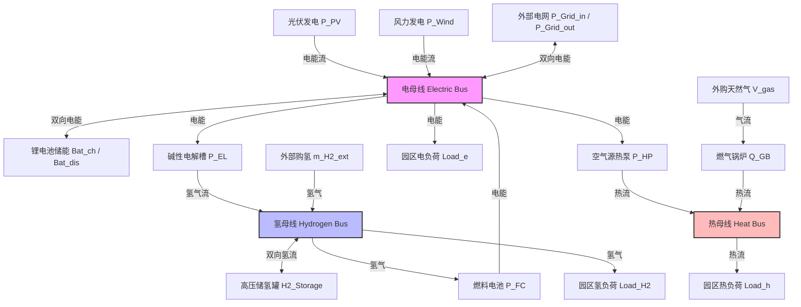

# 面向零碳工业园区的电-热-氢-储综合能源系统容量配置与多维风险抵御优化研究

## 一、 摘要 (Abstract) 与 关键词 (Keywords)

### 摘要
随着全球气候变化加剧与我国“双碳”目标的深入推进，工业园区作为能源消耗与碳排放的集中区域，其低碳/零碳化转型已成为能源系统变革的关键战役。电-热-氢-储综合能源系统（IES）将可再生能源发电、电化学储能、氢能链路（电解槽制氢、储氢、燃料电池发电）以及热能链路（空气源热泵、燃气锅炉）深度耦合，是提升本地新能源消纳、满足多元负荷需求的重要技术路径。然而，风光资源的强随机波动与多能负荷的季节性/突发性上升，给系统的高效规划与安全运行带来了严峻挑战。

针对上述挑战，本文以中国内蒙古鄂尔多斯零碳产业园为典型工程背景，构建了一套精细化的电-热-氢-储综合能源系统电-热-氢-储-碳联合优化配置模型。该模型在物理侧精细化刻画了空气源热泵随室外温度动态修正的COP曲线、电解槽与燃料电池的最小负荷及效率机制、电池的吞吐退化成本以及储氢罐的跨时段缓冲作用；在市场侧深度融合了蒙西工商业分时电价、大工业需量电费、余电上网限制、外购氢兜底价格以及全国碳交易机制。为应对多维不确定性风险，本文进一步设计了基于关键场景的随机容量规划与基于最不利场景的鲁棒容量规划模型，实现了投资安全裕度与经济期望性的最优折中。

基于补齐后的第一组园区实证数据，研究结果表明：
1. 本地风电与空气源热泵是系统降本脱碳的第一驱动力。在确定性容量规划下，系统最优配置为风电 23.04 MW、光伏 6.40 MW、碱性电解槽 3.32 MW、储氢 321.44 kg、空气源热泵 2.93 MW，年度总成本为 2040.78 万元，可实现年度购电量为 0，本地绿电比例高达 99.92%。
2. 电解槽制氢具备“新能源消纳”与“增加电力负荷”的双重属性，使得新能源消纳率可提升至 100%，但在风光出力不足时会小幅推高外购电量。
3. 敏感性分析表明系统总成本对风电及光伏 CAPEX 最为敏感。Pareto 成本-碳排权衡分析指出，在当前高比例新能源配置基准下，低碳目标与经济性已基本实现统一，碳排上限收紧 60% 仅带来 0.25% 的年度总成本上升。
4. 压力测试表明确定性方案在极端场景（风光偏低且负荷偏高）下面临成本翻倍（上涨 102.97%）的断供/高额购电风险。
5. 随机规划和鲁棒规划均通过适度超前投资风电、电解槽、储氢和热泵容量来抵御风险。鲁棒规划在最不利场景下将风电推高至 30 MW 的上限，并大幅增加光伏（13.08 MW）及电池（329 kW/693 kWh）配置，从而用额外 47% 的年化投资换取了最极端场景下运行成本与碳排放的稳定可控。

### 关键词
零碳工业园区；综合能源系统（IES）；电-热-氢-储协同；容量规划；随机优化；鲁棒优化；多维风险抵御

---

## 二、 引言 (Introduction)

### 1. 研究背景与意义
工业园区是我国实体经济的重要载体，也是我国落实减排降碳工作的主战场。统计数据表明，我国各类国家级和省级工业园区消耗了全国近70%的工业能源，其二氧化碳排放量占全国总排放量的30%以上。传统工业园区高度依赖于化石能源的直接燃烧以及电网的火力发电购电，面临着高昂的用能成本与巨大的碳排放压力。在“碳达峰、碳中和”目标驱动下，如何通过就地开发风光等可再生能源，并结合多能流的高效转换与存储，实现园区用能的百分之百清洁替代，已成为学术界与工程界的核心研究课题。

电-热-氢-储综合能源系统（IES）通过打破传统电、热、气等单一能源系统的壁垒，实现了多能流在物理侧与时间侧的协同互补。尤其在我国三北（华北、东北、西北）地区，可再生能源资源极其充沛，建设以大型风光发电为基础，电化学储能为日内灵活性平抑手段，氢能与热能为跨介质转换耦合载体的零碳园区综合能源系统，已具备坚实的工程基础。

### 2. 国内外研究现状与局限性分析
针对综合能源系统的规划与运行优化，国内外研究人员已开展了大量探索。在建模深度方面，现有文献大多侧重于电-热或电-气双能耦合系统，对氢能链路的精细化表征偏少。许多文献将电解槽与燃料电池的效率简化为常数，而实际上电解槽在低负荷率运行时存在明显的冷态启动、效率衰减及最小功率运行限制；同时，对于电池储能的建模往往忽略了其频繁充放电带来的电化学退化成本（Degradation Cost），这导致优化调度倾向于频繁调用电池，从而高估了储能的经济价值。在热力系统方面，大批文献将热泵的能效比（COP）视为固定值，未考虑北方地区冬季极寒条件下，室外气温下降导致的 COP 骤降及制热能力衰减，这给实际工程中冬季采暖保供带来了安全隐患。

在不确定性风险防御方面，目前主流的规划方法可分为确定性规划、随机优化和鲁棒优化。
*   **确定性规划**：基于新能源出力与负荷的平均预测值进行设备容量选择。然而，在实际工程中，风电与光伏受天气影响波动剧烈，且重工业负荷（如电弧炉、大功率电炉等）和采暖负荷存在高随机性突发峰值，一旦系统遭遇“无风无光”或“负荷激增”场景，确定性方案将不得不依赖大容量的电网购电，导致运行电费飙升和碳排放超限，甚至发生断电断热事故。
*   **随机优化（Stochastic Optimization）**：通过生成大量代表性的不确定性场景（Scenarios）并为其赋予发生概率，以期望总成本最低为目标进行决策。然而，当多能系统耦合紧密时，场景数量呈指数级增加，导致混合整数线性规划（MILP）的计算维度大幅提升，求解极其困难；因而实际研究常过度删减场景，降低了模型防范低概率极端风险的能力。
*   **鲁棒优化（Robust Optimization）**：以最不利的极端场景为规划基准，寻找使系统在最坏工况下运行成本与安全表现最优的配置。鲁棒优化的最大局限在于其配置往往过于保守（Conservatism），为防范极低概率的极端事件而投入了过高的设备投资（CAPEX），在常规运行场景下造成大量的容量闲置和经济性恶化。

此外，现有的综合能源系统容量配置研究对于电力市场实际机制的契合度较低。例如，我国大工业用户普遍实行的“两部制电价”（电量电费与需量/容量电费）、余电上网容量限制以及外购氢能的物流价格屏障，在规划层面常被大而化之地简化，导致规划出的设备容量在实际园区中难以上线运行。

### 3. 本文主要工作与创新点
针对上述研究局限与实际工程需求，本文基于内蒙古鄂尔多斯零碳工业园区的地理、气象、负荷与蒙西电网政策文件，构建了电-热-氢-储-碳联合优化调度与容量配置物理-经济模型，其主要工作和创新点体现在以下三个方面：

1.  **多能物理链路与经济政策的精细化建模**：
    构建了融合电、热、氢、碳的综合物理链路拓扑。物理侧引入了随室外温度（T2M）动态修正的空气源热泵逐时 COP 曲线、电池吞吐量寿命衰减退化成本、电解槽与燃料电池的物理出力区间限值及分段线性效率曲线；经济政策侧完整实现了蒙西工商业分时电价（包含夏季尖峰/深谷调节）、两部制需量电费累进惩罚、余电上网额度控制、外购氢配送屏障及全国统一碳市场均价机制，确保了优化方案的工程落地可行性。
2.  **多维风险抵御的规划决策框架构建**：
    为了平衡规划的经济性与抗灾安全性，提出了一个两阶段的容量规划-运行调度优化架构。在对比确定性多典型日加权年化配置的基础上，设计了以平均运营成本期望最低为目标的**多场景随机规划模型**，以及专为抵御最极端天气/负荷叠加风险设计的**最不利场景鲁棒规划模型**，清晰界定了不同风险偏好下的决策边界。
3.  **基于实证数据的工程机理解析与量化权衡**：
    使用补齐后的第一组真实气象（NASA POWER 2024）与工业负荷数据进行了系统的计算实验。揭示了风电作为主力电源的物理合理性、电解制氢对新能源就地消纳的物理调控规律、热泵对燃气锅炉的大比例替代路径；深入剖析了燃料电池配置为0的深层经济学边界；量化了成本与碳排放的 Pareto 权衡弹性；并系统性地对比了确定性、随机与鲁棒规划在容量配比、年化投资与极端场景购电控制上的异同。

---

## 三、 电-热-氢-储综合能源系统建模 (System Modeling & Formulation)

电-热-氢-储系统集成了风力发电、光伏发电、电化学储能、碱性电解制氢系统、高压储氢系统、燃料电池发电子系统、空气源热泵系统以及燃气锅炉。系统的基本拓扑结构如图1所示：


<center>图1：电-热-氢-储综合能源系统物理拓扑结构</center>

### 1. 设备物理与出力模型

#### (1) 风光发电出力模型
风电机组和光伏发电在 $t$ 时刻的实际出力与其配置容量以及该时段的容量因子密切相关：
$$P_{\text{Wind},t} = C_{\text{Wind}} \cdot \text{wind\_cf}_t \quad \forall t \in \mathcal{T}$$
$$P_{\text{PV},t} = C_{\text{PV}} \cdot \text{pv\_cf}_t \quad \forall t \in \mathcal{T}$$
式中：$C_{\text{Wind}}$ 和 $C_{\text{PV}}$ 分别为待优化的风电与光伏装机容量（kW）；$\text{wind\_cf}_t$ 和 $\text{pv\_cf}_t$ 分别为 $t$ 时刻的风电和光伏容量因子（0-1）。

其中光伏容量因子的计算模型嵌入了室外环境温度修正：
$$\text{pv\_cf}_t = \max\left\{0, \min\left[0.95, \frac{\text{GHI}_t}{1000} \cdot \eta_{\text{sys}} \cdot \left(1 - \gamma_{\text{temp}} \cdot \max(0, T_{\text{module},t} - 25)\right)\right]\right\}$$
$$T_{\text{module},t} = T_{2\text{M},t} + 20 \cdot \left(\frac{\text{GHI}_t}{800}\right)$$
式中：$\text{GHI}_t$ 为水平面太阳能总辐照度（$\text{W/m}^2$）；$\eta_{\text{sys}}$ 为系统综合效率，取0.82；$\gamma_{\text{temp}}$ 为组件温度系数，取 $0.004/^\circ\text{C}$；$T_{2\text{M},t}$ 为 $t$ 时刻的2米高室外温度（$^\circ\text{C}$）；$T_{\text{module},t}$ 为光伏电池组件的实际温度。

#### (2) 锂电池储能模型
锂电池在 $t$ 时刻的状态（SOC）及充放电过程遵循如下物理演流关系：
$$\text{SOC}_t = \text{SOC}_{t-1} + \left(P_{\text{Bat,ch},t} \cdot \eta_{\text{ch}} - \frac{P_{\text{Bat,dis},t}}{\eta_{\text{dis}}}\right) \cdot \Delta t \quad \forall t \in \mathcal{T}$$
$$0 \le P_{\text{Bat,ch},t} \le P_{\text{Bat}} \quad \forall t \in \mathcal{T}$$
$$0 \le P_{\text{Bat,dis},t} \le P_{\text{Bat}} \quad \forall t \in \mathcal{T}$$
$$\text{SOC}_{\text{min}} \cdot E_{\text{Bat}} \le \text{SOC}_t \le \text{SOC}_{\text{max}} \cdot E_{\text{Bat}} \quad \forall t \in \mathcal{T}$$
式中：$P_{\text{Bat}}$ 和 $E_{\text{Bat}}$ 分别为锂电池的额定功率（kW）与额定容量（kWh）；$P_{\text{Bat,ch},t}$ 和 $P_{\text{Bat,dis},t}$ 分别为 $t$ 时刻的充电与放电电功率（kW）；$\eta_{\text{ch}}$ 和 $\eta_{\text{dis}}$ 分别为充电与放电效率，均取 0.95；$\text{SOC}_{\text{min}}$ 和 $\text{SOC}_{\text{max}}$ 分别为电池最低和最高荷电状态比例，设为 0.2 和 0.8；$\Delta t$ 为调度时间步长，取 1 小时。为了保证系统运行周期的连续性，约定调度期末状态与初始状态一致：$\text{SOC}_{T} = \text{SOC}_{0}$。

为合理平抑电池的无序循环，引入**储能吞吐退化成本模型**。退化成本与电池的总吞吐量呈线性对应关系：
$$C_{\text{degrad},t} = \beta_{\text{degrad}} \cdot \left(P_{\text{Bat,ch},t} + P_{\text{Bat,dis},t}\right) \cdot \Delta t \quad \forall t \in \mathcal{T}$$
式中，$\beta_{\text{degrad}}$ 为单位电量吞吐的折算退化成本因子（元/kWh）。

#### (3) 碱性电解制氢系统模型
电解槽在 $t$ 时刻的消耗电能与产氢速率转换关系为：
$$\dot{m}_{\text{EL},t} = \frac{P_{\text{EL},t}}{e_{\text{EL}}} \quad \forall t \in \mathcal{T}$$
$$\mu_{\text{EL,min}} \cdot P_{\text{EL}} \le P_{\text{EL},t} \le P_{\text{EL}} \quad \forall t \in \mathcal{T}$$
式中：$P_{\text{EL}}$ 为电解槽的配置装机功率（kW）；$P_{\text{EL},t}$ 为 $t$ 时刻的电解电功率；$\dot{m}_{\text{EL},t}$ 为产氢速率（kg/h）；$e_{\text{EL}}$ 为单位制氢耗电系数（kWh/kgH₂），推荐基准取 55.0 kWh/kgH₂；$\mu_{\text{EL,min}}$ 为电解槽的最小稳定负荷运行比例，取 0.15。

#### (4) 高压储氢罐模型
储氢罐主要用于实现制氢和用氢在时间侧的解耦，其库存动态方程表示为：
$$M_{\text{H2},t} = M_{\text{H2},t-1} \cdot (1 - \alpha_{\text{loss}}) + \left(\dot{m}_{\text{H2,in},t} - \dot{m}_{\text{H2,out},t}\right) \cdot \Delta t \quad \forall t \in \mathcal{T}$$
$$0 \le M_{\text{H2},t} \le M_{\text{H2,max}} \quad \forall t \in \mathcal{T}$$
$$\dot{m}_{\text{H2,in},t} \le \gamma_{\text{tank,in}} \cdot M_{\text{H2,max}} \quad \forall t \in \mathcal{T}$$
$$\dot{m}_{\text{H2,out},t} \le \gamma_{\text{tank,out}} \cdot M_{\text{H2,max}} \quad \forall t \in \mathcal{T}$$
式中：$M_{\text{H2},t}$ 为 $t$ 时刻储氢罐中的存氢量（kg）；$M_{\text{H2,max}}$ 为储氢罐的容量限值（kg）；$\dot{m}_{\text{H2,in},t}$ 和 $\dot{m}_{\text{H2,out},t}$ 分别为 $t$ 时刻的充氢与放氢速率（kg/h）；$\alpha_{\text{loss}}$ 为每日损耗率平摊至每小时的比例，短期典型日取0.001 %/hour；$\gamma_{\text{tank,in}}$ 与 $\gamma_{\text{tank,out}}$ 为充放氢最大倍率因子；期末库存满足 $\text{M}_{\text{H2},T} = \text{M}_{\text{H2},0}$。

#### (5) 燃料电池发电模型
燃料电池消耗氢气并对外输出电能，其基本转换方程如下：
$$P_{\text{FC},t} = \dot{m}_{\text{FC},t} \cdot e_{\text{FC}} \quad \forall t \in \mathcal{T}$$
$$\mu_{\text{FC,min}} \cdot P_{\text{FC}} \le P_{\text{FC},t} \le P_{\text{FC}} \quad \forall t \in \mathcal{T}$$
式中：$P_{\text{FC}}$ 为燃料电池的配置装机功率（kW）；$P_{\text{FC},t}$ 为 $t$ 时刻的发电功率；$\dot{m}_{\text{FC},t}$ 为燃料电池的耗氢速率（kg/h）；$e_{\text{FC}}$ 为单位氢气转电系数（kWh/kgH₂），推荐基准取 18.5 kWh/kgH₂；$\mu_{\text{FC,min}}$ 为燃料电池最小出力限制，取 0.20。

#### (6) 空气源热泵制热模型
热泵消耗电能并产出热量，其能效比（COP）随室外气温变化：
$$Q_{\text{HP},t} = P_{\text{HP},t} \cdot \text{COP}_t \quad \forall t \in \mathcal{T}$$
$$0 \le P_{\text{HP},t} \le P_{\text{HP}} \quad \forall t \in \mathcal{T}$$
式中：$P_{\text{HP}}$ 为热泵配置功率（kW）；$P_{\text{HP},t}$ 为 $t$ 时刻的耗电功率；$Q_{\text{HP},t}$ 为 $t$ 时刻产生的热量功率（kWth）。

根据鄂尔多斯冬季与夏季的气象环境，空气源热泵的 $\text{COP}_t$ 采用分段温度修正机制：
*   **冬季**（环境温度较低）：$\text{COP}_t = 2.6$。
*   **夏季**（环境温差小，效率高）：$\text{COP}_t = 4.0$。
*   **过渡季**：$\text{COP}_t = 3.5$。

#### (7) 燃气锅炉模型
燃气锅炉以天然气为主要燃料，作为热负荷的备用与兜底保障：
$$Q_{\text{GB},t} = \dot{V}_{\text{gas},t} \cdot \text{LHV}_{\text{gas}} \cdot \eta_{\text{GB}} \quad \forall t \in \mathcal{T}$$
$$0 \le Q_{\text{GB},t} \le Q_{\text{GB}} \quad \forall t \in \mathcal{T}$$
式中：$Q_{\text{GB}}$ 为燃气锅炉的最大供热功率（kWth）；$Q_{\text{GB},t}$ 为 $t$ 时刻的实际供热功率；$\dot{V}_{\text{gas},t}$ 为天然气逐时流量消耗量（$\text{m}^3/\text{h}$）；$\text{LHV}_{\text{gas}}$ 为天然气低位发热量，取 $10.814\text{ kWh/m}^3$；$\eta_{\text{GB}}$ 为燃气锅炉效率，取 0.87。

---

### 2. 能量母线平衡约束

综合能源系统在每个调度时刻 $t$ 都必须严格满足电力、热力与氢能的母线平衡约束。

#### (1) 电量平衡约束
电母线在每个时段必须保持瞬时平衡：
$$P_{\text{PV},t} + P_{\text{Wind},t} + P_{\text{Grid\_in},t} + P_{\text{FC},t} + P_{\text{Bat,dis},t} = P_{\text{Load\_e},t} + P_{\text{Grid\_out},t} + P_{\text{Bat,ch},t} + P_{\text{EL},t} + P_{\text{HP},t} \quad \forall t \in \mathcal{T}$$
式中：$P_{\text{Grid\_in},t}$ 和 $P_{\text{Grid\_out},t}$ 分别为系统向外部电网购买和出售的电功率（kW）；$P_{\text{Load\_e},t}$ 为园区在 $t$ 时刻的用电负荷（kW）。

#### (2) 热量平衡约束
热能无法在空间上大范围跨时段储存，每个时刻必须实现热力的源荷平衡：
$$Q_{\text{HP},t} + Q_{\text{GB},t} = Q_{\text{Load\_h},t} \quad \forall t \in \mathcal{T}$$
式中，$Q_{\text{Load\_h},t}$ 为园区在 $t$ 时刻的热负荷（kWth）。

#### (3) 氢量平衡约束
氢母线需要时刻保持平衡，本地制氢量与外购氢量之和必须等于本地耗氢量与储氢动态调整之和：
$$\dot{m}_{\text{EL},t} + \dot{m}_{\text{H2\_ext},t} + \dot{m}_{\text{H2,out},t} = \dot{m}_{\text{Load\_H2},t} + \dot{m}_{\text{FC},t} + \dot{m}_{\text{H2,in},t} \quad \forall t \in \mathcal{T}$$
式中：$\dot{m}_{\text{H2\_ext},t}$ 为从外部紧急外购并配送至园区的氢量（kg/h）；$\dot{m}_{\text{Load\_H2},t}$ 为园区在 $t$ 时刻的刚性氢负荷（kg/h）。

---

### 3. 市场与机制政策约束

#### (1) 外部电网交互限制
系统通过并网点与公用电网交互，面临变压器与联络线最大容量限制：
$$0 \le P_{\text{Grid\_in},t} \le P_{\text{max,import}} \quad \forall t \in \mathcal{T}$$
$$0 \le P_{\text{Grid\_out},t} \le P_{\text{max,export}} \quad \forall t \in \mathcal{T}$$
式中：$P_{\text{max,import}}$ 和 $P_{\text{max,export}}$ 分别为允许从电网购电和向电网外送电的最大联络线功率限制（kW）。

#### (2) 需量电费结算机制
采用大工业大额定需量申报计费规则。需量电费基于整个计费年度或结算场景中从电网购电的最大瞬时功率进行结算：
$$P_{\text{demand\_peak}} \ge P_{\text{Grid\_in},t} \quad \forall t \in \mathcal{T}$$
$$C_{\text{demand}} = P_{\text{demand\_peak}} \cdot p_{\text{demand\_rate}}$$
式中：$P_{\text{demand\_peak}}$ 为各时段的购电最大峰值（kW）；$p_{\text{demand\_rate}}$ 为年化需量电费单价，折合为 393.6 元/kW·年。

#### (3) 绿电利用率约束
为响应政府对高比例清洁用能的政策红线，新能源就地消纳比例不能低于政策标准：
$$\frac{\sum_{t \in \mathcal{T}} \left(P_{\text{PV},t} + P_{\text{Wind},t} - P_{\text{Grid\_out},t}\right) \cdot \Delta t}{\sum_{t \in \mathcal{T}} \left(P_{\text{PV},t} + P_{\text{Wind},t}\right) \cdot \Delta t} \ge \rho_{\text{RE\_util}}$$
式中，$\rho_{\text{RE\_util}}$ 为新能源最低就地利用率要求，设为 90%。

#### (4) 年度碳排放上限约束
为了控制园区的碳排放量，要求系统由于电力外购及天然气燃烧带来的总二氧化碳排放不超过政策设定的排放上限：
$$E_{\text{Total}} = \sum_{t \in \mathcal{T}} \left(P_{\text{Grid\_in},t} \cdot \text{EF}_{\text{grid}} + \dot{V}_{\text{gas},t} \cdot \text{EF}_{\text{gas}}\right) \cdot \Delta t \le E_{\text{Cap}}$$
式中：$\text{EF}_{\text{grid}}$ 为蒙西电网的度电排放因子，取 $0.6849\text{ kgCO}_2/\text{kWh}$；$\text{EF}_{\text{gas}}$ 为天然气燃烧排放因子，取 $2.16\text{ kgCO}_2/\text{m}^3$；$E_{\text{Cap}}$ 为年度碳排放限制上限。

#### (5) 燃料电池容量备用价值量化模型
将燃料电池在紧急状态下防范停电损失的备用保供价值计入系统规划收益。燃料电池容量备用价值表示为：
$$V_{\text{FC,backup}} = P_{\text{FC}} \cdot v_{\text{backup}}$$
式中：$v_{\text{backup}}$ 为单位功率的容量备用补偿，基准取 300 元/kW·年。该值可由园区的平均停电时间、停电损失（VOLL）及同等规模的应急柴油发电机建设与运维成本进行折算。

---

## 四、 优化问题框架设计 (Optimization Framework)

为全面评估电-热-氢-储协同优化系统的经济性与抗灾能力，本文设计了一个两阶段优化配置决策框架。该框架由固定容量的多能协同日调度模型、多典型日加权年化规划模型，以及应对风光/负荷波动的随机容量规划和鲁棒容量规划模型组成。

### 1. 多能协同日调度模型
在设备容量给定的前提下，日调度模型旨在通过优化24小时内各设备的出力及与电网的交互，最小化系统单日总运行成本 $F_{\text{run}}$。目标函数定义为：
$$\min F_{\text{run}} = \sum_{t \in \mathcal{T}} \left( C_{\text{grid},t} + C_{\text{gas},t} + C_{\text{degrad},t} + C_{\text{om},t} + C_{\text{carbon},t} + C_{\text{curt},t} + C_{\text{H2\_ext},t} \right) \cdot \Delta t$$
式中，各项成本的具体表达式如下：
*   **电网交互电费** $C_{\text{grid},t}$：
    $$C_{\text{grid},t} = p_{\text{buy},t} \cdot P_{\text{Grid\_in},t} - p_{\text{sell},t} \cdot P_{\text{Grid\_out},t}$$
    其中 $p_{\text{buy},t}$ 和 $p_{\text{sell},t}$ 分别为 $t$ 时刻的购电与售电分时电价（元/kWh）。
*   **天然气消耗成本** $C_{\text{gas},t}$：
    $$C_{\text{gas},t} = p_{\text{gas}} \cdot \dot{V}_{\text{gas},t}$$
    其中 $p_{\text{gas}}$ 为管道天然气价格（元/m³）。
*   **储能退化成本** $C_{\text{degrad},t}$：由第三章式（4）给出。
*   **设备可变运维成本** $C_{\text{om},t}$：
    $$C_{\text{om},t} = \beta_{\text{EL\_om}} \cdot \dot{m}_{\text{EL},t} + \beta_{\text{FC\_om}} \cdot P_{\text{FC},t} + \beta_{\text{HP\_om}} \cdot Q_{\text{HP},t}$$
    其中 $\beta_{\text{EL\_om}}$、$\beta_{\text{FC\_om}}$ 和 $\beta_{\text{HP\_om}}$ 分别为电解槽（元/kg）、燃料电池（元/kWh）和热泵（元/kWhth）的可变运维单价。
*   **环境碳税/碳成本** $C_{\text{carbon},t}$：
    $$C_{\text{carbon},t} = p_{\text{carbon}} \cdot \left( P_{\text{Grid\_in},t} \cdot \text{EF}_{\text{grid}} + \dot{V}_{\text{gas},t} \cdot \text{EF}_{\text{gas}} \right)$$
    其中 $p_{\text{carbon}}$ 为碳市场交易单价（元/kgCO₂）。
*   **新能源弃电惩罚** $C_{\text{curt},t}$：
    $$C_{\text{curt},t} = p_{\text{curt}} \cdot P_{\text{curt},t}$$
    其中 $p_{\text{curt}}$ 为单位弃电惩罚（元/kWh）；$P_{\text{curt},t}$ 为弃风弃光功率：
    $$P_{\text{curt},t} = C_{\text{Wind}} \cdot \text{wind\_cf}_t + C_{\text{PV}} \cdot \text{pv\_cf}_t - P_{\text{Wind},t} - P_{\text{PV},t}$$
*   **外部购氢兜底成本** $C_{\text{H2\_ext},t}$：
    $$C_{\text{H2\_ext},t} = p_{\text{H2\_ext}} \cdot \dot{m}_{\text{H2\_ext},t}$$
    其中 $p_{\text{H2\_ext}}$ 为园区无法自给时的外购氢气单价（元/kg）。

### 2. 多典型日加权年化配置规划模型
多典型日加权规划模型同时对系统的**设备容量配置（第一阶段决策）**和**多典型日协同调度（第二阶段决策）**进行协同优化。目标是使系统年化总成本（TAC）最低。
$$\min \text{TAC} = \text{CAPEX}_{\text{annual}} + \text{OPEX}_{\text{annual}} - V_{\text{FC,backup\_annual}}$$

#### (1) 年化投资成本（CAPEX）
利用资金回收系数（CRF）将各设备的一次性投资折算至各年：
$$\text{CAPEX}_{\text{annual}} = \sum_{i \in \mathcal{I}} \text{CRF}_i \cdot \text{Cost}_i \cdot C_i$$
$$\text{CRF}_i = \frac{r \cdot (1+r)^{L_i}}{(1+r)^{L_i} - 1}$$
式中：$\mathcal{I}$ 为候选规划设备集合，包括风电、光伏、电池储能功率/容量、电解槽、储氢罐、燃料电池和热泵；$\text{Cost}_i$ 为设备 $i$ 的单位容量投资造价；$C_i$ 为设备 $i$ 的决策容量；$r$ 为年折现率；$L_i$ 为设备 $i$ 的物理寿命。

#### (2) 年度运行成本（OPEX）
基于代表不同季节特征的典型日组合进行加权年化折算，并计入需量电费与固定运维成本：
$$\text{OPEX}_{\text{annual}} = \sum_{s \in \mathcal{S}} w_s \cdot F_{\text{run}, s} + C_{\text{demand\_annual}} + \sum_{i \in \mathcal{I}} \beta_{\text{fixed\_om}, i} \cdot C_i$$
式中：$\mathcal{S}$ 为典型日集合（包括夏季、冬季、过渡季）；$w_s$ 为典型日 $s$ 在全年的代表天数；$F_{\text{run}, s}$ 为典型日 $s$ 的日调度运行成本之和（按照式（14）进行24小时积分）；$\beta_{\text{fixed\_om}, i}$ 为设备 $i$ 的年固定运维成本单价（元/kW·年）；$C_{\text{demand\_annual}}$ 为年化大工业最大需量电费，其值取决于所有典型日中出现的购电峰值：
$$C_{\text{demand\_annual}} = \max_{s \in \mathcal{S}, t \in \mathcal{T}} \left( P_{\text{Grid\_in}, s, t} \right) \cdot p_{\text{demand\_rate}}$$
式中，$p_{\text{demand\_rate}}$ 为年化需量单价。

#### (3) 燃料电池年化备用价值收益
$$V_{\text{FC,backup\_annual}} = P_{\text{FC}} \cdot v_{\text{backup}}$$

### 3. 抵御多维风险的不确定性优化模型
为防范气象资源与负荷波动带来的断供与购电飙升风险，本文分别引入了两种不确定性优化决策框架。

#### (1) 随机容量规划模型（Stochastic Capacity Planning）
随机规划以期望总成本最低为优化方向。它在容量决策阶段同时输入 NORMAL（常规）、LOAD_HIGH（负荷偏高）以及 EXTREME（极端风光偏低且负荷激增）等多个不同概率发生的不确定性场景 $\omega \in \Omega$。
其两阶段数学结构表示为：
$$\min \text{TAC}_{\text{stoch}} = \text{CAPEX}_{\text{annual}} + \sum_{\omega \in \Omega} \pi_\omega \cdot \text{OPEX}_{\text{annual}, \omega} - V_{\text{FC,backup\_annual}}$$
式中：$\Omega$ 为典型场景集合；$\pi_\omega$ 为各场景的发生概率，满足 $\sum_{\omega \in \Omega} \pi_\omega = 1$；$\text{OPEX}_{\text{annual}, \omega}$ 为在场景 $\omega$ 对应的资源与负荷输入下，系统全年运行成本的年化折算值。
第一阶段决策变量（设备容量 $C_i$）在所有不确定性场景中保持唯一性与一致性；第二阶段运行决策变量（如各场景下的 $P_{\text{Bat},s,t,\omega}$、$P_{\text{Grid\_in},s,t,\omega}$）则随场景 $\omega$ 的改变而动态调整。

#### (2) 鲁棒容量规划模型（Robust Capacity Planning）
鲁棒优化关注系统在“最坏工况”下的安全性。在本研究中，鲁棒规划强制要求系统构建的容量方案必须能够**无损地防御最不利的极端不确定性场景 $\omega_{\text{worst}}$（即 EXTREME 场景）**，即使在风光打折、负荷高企的状态下，也不得发生热、氢断供，且必须满足绿电及碳排放红线。
其鲁棒规划的目标函数定义为：
$$\min \text{TAC}_{\text{robust}} = \text{CAPEX}_{\text{annual}} + \text{OPEX}_{\text{annual}, \omega_{\text{worst}}} - V_{\text{FC,backup\_annual}}$$
约束条件强制系统在最不利场景 $\omega_{\text{worst}}$ 下的所有调度时刻均能维持电-热-氢物理天平。相比随机规划，鲁棒规划不考虑场景概率，仅着眼于防范最大风险的上界，因而其容量决策会更偏向安全与保守。

---

## 五、 数据来源与实验场景设计 (Data & Experimental Design)

### 1. 鄂尔多斯园区实证数据集
本文计算实验的数据完全定位于**中国内蒙古鄂尔多斯地区**。

#### (1) 气象与新能源资源数据
利用 NASA POWER Hourly API 获取了鄂尔多斯（北纬 39.61$^\circ$，东经 109.78$^\circ$）2024 年全年的逐时水平面辐照度（GHI）、50m高度风速以及2米室外温度。光伏与风电的容量因子（$\text{pv\_cf}_t$、$\text{wind\_cf}_t$）按照第三章式（2）与（5）进行推导。

#### (2) 多能负荷重构
由于园区实测负荷不易获取，本文基于 Surbana Jurong 零碳产业园案例及相关装备制造工业园区负荷尺度（年电消耗约 1.2 TWh），重构了典型的电、热、氢时序负荷。
*   **电负荷**：模拟三班倒工业生产。白天（8-18点）处于主生产期，负荷上浮 7%；傍晚（18-23点）小幅上浮 3%；深夜（0-5点）生产强度最低，负荷下浮 7%。夏季（6-9月）由于空调用电，负荷上浮 3%。
*   **热负荷**：工业生产基负荷固定为 62 MW；空间采暖热负荷采用温度敏感函数重构（低于 $18^\circ\text{C}$ 时每下降 $1^\circ\text{C}$ 增加 1.9 MW 热需求）。
*   **氢负荷**：工业用氢基荷为 960 kg/h，并在白天（7-20点）重卡物流运输高峰段引入 110 kg/h 的上浮，夜间则下浮 45 kg/h。

#### (3) 设备经济与技术参数
各候选规划设备的投资造价、固定运维、物理寿命均来自 **IRENA 2024 可再生能源成本报告**、**CNESA 储能中标价统计**以及 **US DOE 技术目标报告**，并进行了人民币折算。详细参数见表1：

<center>表1：设备技术与年化经济参数列表</center>

| 设备名称 | 投资造价 (Cost_i) | 年固定运维成本 ($\beta_{\text{fixed\_om}}$) | 寿命 ($L_i$) | 折现率 ($r$) | 数据来源 |
| :--- | :--- | :--- | :---: | :---: | :--- |
| **风电机组** | 7,500 元/kW | 140 元/kW·年 | 20 年 | 6% | IRENA 2024 (全球 onshore wind) |
| **光伏系统** | 5,000 元/kW | 60 元/kW·年 | 25 年 | 6% | IRENA 2024 (全球 PV 均价折算) |
| **电池储能(能量)**| 1,000 元/kWh | - | 12 年 | 6% | CNESA 2024 (LFP系统中标均价) |
| **电池储能(功率)**| 800 元/kW | - | 12 年 | 6% | 行业 PCS 及 BOP 造价折算 |
| **碱性电解槽** | 2,200 元/kW | - | 15 年 | 6% | US DOE / IRENA 2024 |
| **储氢罐** | 3,600 元/kg | - | 20 年 | 6% | 储氢技术成本文献折中 |
| **PEM燃料电池** | 6,000 元/kW | - | 10 年 | 6% | DOE 2023 交通/固定式成本目标 |
| **空气源热泵** | 3,500 元/kWth | - | 15 年 | 6% | IRENA 商业热泵成本折算 |

#### (4) 市场价格与排放因子
*   **购售电价**：购电平时电价以 0.45 元/kWh 为基准，峰平时段和比例严格依据蒙西电网工商业两部制销售电价文件生成。需量电费单价为 393.6 元/kW·年。余电上网价格为 0.2829 元/kWh。
*   **天然气与外购氢**：管道气售价 2.952 元/m³（鄂尔多斯市发改委非居民管道气价）；外购氢兜底价 48.6 元/kg，售氢收益 45.7 元/kg（中国氢能发展报告）。
*   **排放因子与碳价**：内蒙古电网排放因子 0.6849 kgCO₂/kWh；天然气排放因子 2.16 kgCO₂/m³；碳排放权均价 62.36 元/tCO₂（全国碳市场交易均价）。

---

### 2. 递进式分析场景设置 (S0 - S5)
为定量测试多能互补链路中各个核心设备对系统成本与碳排放的边际影响，本文设计了六个由浅入深的技术集成场景（设备容量在此六场景中保持给定），如表2所示：

<center>表2：日调度技术集成场景 (S0-S5) 含义表</center>

| 场景编号 | 场景名称 | 启用技术与市场机制 | 核心作用与观察指标 |
| :---: | :--- | :--- | :--- |
| **S0** | 传统供能基准 | 电网购电 + 燃气锅炉供热 | 作为对比基准，观察纯化石能源依赖下的高成本与高排放。 |
| **S1** | 新能源电源接入 | S0 + 本地风电与光伏 | 评估本地无碳电源对替代外购电、降低运行费用的第一阶段作用。 |
| **S2** | 电储能调节接入 | S1 + 锂电池储能（考虑退化成本） | 观察电储能对多时段电力负荷的搬移能力，以及对弃风光的消纳。 |
| **S3** | 氢能初级耦合 | S2 + 碱性电解槽 + 高压储氢罐 | 引入刚性氢负荷，分析“电制氢”作为消纳途径和电力需求的双重属性。 |
| **S4** | 电热氢多能协同 | S3 + 空气源热泵 + 燃料电池（备用）| 打通电-热-氢深度协同。评估热泵对燃气锅炉的替代及对天然气的削减。 |
| **S5** | 引入碳市场机制 | S4 + 显性碳排放交易价格 | 分析碳价对系统日调度出力结构的引导作用，以及总碳成本的核算。 |

---

### 3. 不确定性场景筛选
在容量规划、随机规划和鲁棒规划中，本文设计了 NORMAL、WIND_LOW、LOAD_HIGH 和 EXTREME 四个运行场景。不同场景下资源因子与负荷需求的偏离比例见表3：

<center>表3：不确定性场景的资源与负荷偏离参数</center>

| 场景名称 | 发生概率 ($\pi_\omega$) | 风电容量因子 | 光伏容量因子 | 电/热负荷 | 氢负荷 | 场景工程含义 |
| :---: | :---: | :---: | :---: | :---: | :---: | :--- |
| **NORMAL** | 0.60 | 100% (常规) | 100% (常规) | 100% (常规) | 100% (常规) | 标准气象资源与负荷期望值场景。 |
| **WIND_LOW** | - | **下浮 30%** | 100% | 100% | 100% | 气象侧单一风险：大范围无风或低风力资源。 |
| **LOAD_HIGH**| 0.35 | 100% | 100% | **上浮 10%** | 100% | 需求侧单一风险：工业扩产或采暖需求超预期。 |
| **EXTREME** | 0.05 | **下浮 30%** | **下浮 30%** | **上浮 15%** | **上浮 15%** | 最不利综合风险：风光极度匮乏且多能负荷集中暴涨。 |

---

## 六、 实验结果与工程机理解析 (Results & Discussion)

### 1. S0-S5 递进日调度运行结果与物理机理解读
基于前文设计的技术集成场景，利用 Pyomo 在固定容量（风电 10 MW，光伏 8 MW，电池 5 MW/10 MWh，电解槽 2 MW，储氢罐 1000 kg，燃料电池 1 MW，热泵 3 MW，锅炉 8 MW）口径下对典型日调度进行求解，各场景日度量化结算结果如表4所示：

<center>表4：典型日调度场景 (S0-S5) 量化结果对比表</center>

| 场景 | 日度总成本 (万元) | 外部购电量 (万 kWh) | 天然气消耗 (万 m³) | 碳排放 (万 kgCO₂) | 新能源消纳率 | 弃风光电量 (万 kWh) |
| :---: | :---: | :---: | :---: | :---: | :---: | :---: |
| **S0** | 13.47 | 16.70 | 1.45 | 13.95 | - | - |
| **S1** | 6.05 | 2.29 | 1.45 | 4.62 | 93.20% | 1.05 |
| **S2** | 5.40 | 1.58 | 1.45 | 4.16 | 98.59% | 0.22 |
| **S3** | 6.12 | 4.07 | 1.45 | 5.77 | 100.00% | 0.00 |
| **S4** | 4.25 | 6.42 | 0.25 | 5.77 | 100.00% | 0.00 |
| **S5** | 4.61 | 6.42 | 0.25 | 5.77 | 100.00% | 0.00 |

#### (1) 风光替代与降本脱碳效应 (S0 $\rightarrow$ S1)
从 S0 传统供能基准切换至 S1 新能源并网后，日度总运行成本由 13.47 万元暴跌至 6.05 万元，降幅达 **55.09%**；日碳排放由 13.95 万 kg 削减至 4.62 万 kg，降幅达 **66.92%**。这直接印证了本地低碳可再生能源在替代高价、高碳外部电网购电时的第一驱动力作用。然而，由于风光出力时序与园区三班制负荷的不完全匹配，S1 中出现了 1.05 万 kWh 的弃风弃光，新能源消纳率为 93.20%。

#### (2) 电化学储能的时间平移效应 (S1 $\rightarrow$ S2)
在 S1 基础上引入电池储能后（S2），新能源消纳率从 93.20% 显著提升至 **98.59%**，单日弃风光电量从 1.05 万 kWh 骤降至 0.22 万 kWh。电池通过在中午光伏大发及深夜风电充沛时充电，在白天用电高峰且高电价段放电，将外购电量从 2.29 万 kWh 进一步压缩至 1.58 万 kWh。虽然本模型计入了储能吞吐退化成本（防止储能无序调用），但储能减少高价购电所带来的经济收益依然大于其退化损耗，使得系统成本进一步降至 5.40 万元。

#### (3) 电制氢链路的物理双重属性 (S2 $\rightarrow$ S3)
S3 引入电解槽制氢和高压储氢以满足园区的刚性氢负荷。运行结果表明，新能源消纳率达到了 **100%**，多余的风光电被完全转化为氢气。然而，系统的单日总成本却从 5.40 万元上升至 6.12 万元，购电量也从 1.58 万 kWh 上升至 4.07 万 kWh。
这一现象深刻揭示了电制氢的**双重属性**：它既是消纳富余新能源的优良灵活性路径，本身又是需要消耗电能的“大负荷”。为了在风光出力不足的时段生产刚性所需的氢气，电解槽不得不被迫向电网购电运行，从而导致购电电费和碳排放的同步回升。

#### (4) 电-热耦合的脱碳杠杆效应 (S3 $\rightarrow$ S4)
S4 引入空气源热泵，打通了电-热物理通道。在 S0-S3 中，热负荷完全依靠燃气锅炉消耗天然气解决，天然气消耗量一直维持在 1.45 万 m³。S4 中热泵配置后，热泵以极高的 COP（基准3.5）承担了 11.94 万 kWhth 的热需求，燃气锅炉退化为补充热源（供热 2.50 万 kWhth），天然气日消耗量骤降 **82.76%**（仅为 0.25 万 m³）。这使得系统总成本进一步下探至 4.25 万元（比传统基准 S0 降低 **68.48%**），热系统实现了深度脱碳。
然而，热泵也将热负荷转移到了电力母线，使日购电量由 4.07 万 kWh 抬升至 6.42 万 kWh，再次体现了跨介质能流转换对电力网的压力搬移。

#### (5) 碳价的核算与引导机制 (S4 $\rightarrow$ S5)
S5 计入全国碳市场均价后，系统单日总成本微升至 4.61 万元（增加了约 3600 元的碳交易支出），但其调度结构与设备出力与 S4 完全一致。这说明在当前相对较低的碳价（62.36 元/tCO₂）下，碳税主要起到成本核算作用，未能改变系统的物理调度状态。若要通过碳价倒逼运行调度微调，需进一步提高碳价单价或引入更严苛的实时碳惩罚。

---

### 2. 确定性容量规划结果与年化分析
在多典型日（夏季、冬季、过渡季）年化规划模型中，让 Pyomo 自由决策设备配置，模型求解状态为 `optimal`。其容量配置及年度核心运行指标如表5所示：

<center>表5：确定性容量规划最优配置与年度运行结算表</center>

| 规划设备 | 最优容量 | 年度核心结算指标 | 数值 |
| :--- | :--- | :--- | :--- |
| **风电装机** | **23.04 MW** | 年度总成本 (TAC) | **2040.78 万元** |
| **光伏装机** | 6.40 MW | 其中：年化投资成本 (CAPEX) | 1961.80 万元 |
| **电池储能功率** | 124.42 kW | 其中：年度运行成本 (OPEX) | 78.98 万元 |
| **电池储能容量** | 261.93 kWh | **年度外部购电量** | **0.00 kWh** |
| **碱性电解槽** | 3.32 MW | 年度上网电量 | 567.07 万 kWh |
| **高压储氢罐** | 321.44 kg | 年度二氧化碳排放量 | 33.76 万 kgCO₂ |
| **PEM燃料电池** | **0.00 kW** | 年度新能源就地利用率 | 94.46% |
| **空气源热泵** | 2.93 MW | 年度绿电用能比例 | 99.92% |

#### (1) 风电为主、光伏为辅的资源适配性
容量规划配置了 23.04 MW 风电与 6.40 MW 光伏。风电容量远大于光伏，主要因为鄂尔多斯属于典型的风资源优质区，风电具有更持久的日内出力周期以及更强的冬季支撑能力，与园区连续生产电负荷及冬季采暖热负荷的匹配度更高。光伏虽造价较低，但其日内集中度过高（仅中午大发），极易造成严重的边际消纳瓶颈，因而其规划容量受到压制。

#### (2) 电池储能规划的边际效应与退化屏障
电池储能仅配置了极小的容量（124 kW / 262 kWh）。这打破了“零碳系统必须配置大容量储能”的传统认知。主要物理机理在于：系统内部已构建了电解制氢-储氢链路以及空气源热泵电-热转换链路，这两条跨介质链路实质上分担了大部分系统的灵活性调节功能（如富余新能源去制氢、去通过热泵产热）；同时，由于模型中计入了 0.1 元/kWh 的退化折旧成本，电池频繁循环的经济效益被合理评估，模型因而不倾向于过度建设高投资的电池。

#### (3) 年度零购电与上网外送的经济逻辑
最优配置下的年度总购电量为 **0.00 kWh**，实现了园区电能的完全自给自足。系统通过适度冗余建设本地风光，依靠 3.32 MW 电解槽和 2.93 MW 热泵就地吸收，并将无法消纳的 567.07 万 kWh 富余电量通过上网联络线出售给电网（余电上网价格 0.2829 元/kWh），实现了年度运行OPEX（含设备固定运维）被压缩至仅有 78.98 万元，系统总成本完全由设备年化投资（1961.80 万元）主导。

#### (4) 燃料电池容量为0的经济性解析
虽然模型考虑了 300 元/kW·年的备用补偿价值，但燃料电池的最优规划容量依然为 0。
根据边际经济性推导，燃料电池的年化 Capex 单价为：
$$\text{Cost}_{\text{FC,annual}} = \text{CRF}_{\text{FC}} \cdot 6000 \approx 0.1358 \cdot 6000 = 814.80 \text{ 元/kW·年}$$
而燃料电池的直接备用年收益仅为 300 元/kW·年。这意味着燃料电池若要在系统中被配置，其在运行调度中必须能够创造大于 $814.8 - 300 = 514.8$ 元/kW·年的发电套利空间。然而，燃料电池的氢转电效率较低（耗氢发电折算综合效率约 50%），且日常发电面临“电$\rightarrow$氢$\rightarrow$储$\rightarrow$电”的二次转换损失，在电网电价差和购电价格约束下，其边际运行收益完全无法覆盖这部分年化投资缺口，因此模型选择配置 0 容量。

---

### 3. 多维度敏感性与 Pareto 权衡分析

#### (1) 设备 Capex 敏感性分析
为了解供应链价格波动对规划配置的影响，对各规划设备的投资造价进行 $0.5 - 1.5$ 倍的浮动测试，年度总成本的敏感区间如图2所示：

```
风电 Capex [0.5x - 1.5x]  =======(1233.68)======================(2770.39)=======
光伏 Capex [0.5x - 1.5x]              =====(1893.60)=====(2130.22)=====
热泵 Capex [0.5x - 1.5x]                ===(1987.08)===(2092.18)===
电解槽 Capex [0.5x - 1.5x]                ===(1999.78)===(2074.91)===
电池 Capex [0.5x - 1.5x]                  ==(2032.36)==(2041.17)==
燃料电池 Capex [0.5x - 1.5x]               (2040.00) (2040.78)
```
<center>图2：设备 Capex 波动对年化总成本的敏感性范围（万元）</center>

敏感性排序为：**风电 > 光伏 > 热泵 > 电解槽 > 电池 > 燃料电池**。
风电成本波动对总成本的拉动范围宽达 1233.68 万 - 2770.39 万元，这与风电在规划中占绝对主力（23 MW）相契合。当光伏成本下调至 0.5 倍时，光伏容量大幅跃升至 8.29 MW，同时配合电池容量增加至 2177 kWh，说明低价光伏会显著推动“新能源+储能”的传统消纳模式；而当电池成本下降一半时，电池功率和容量分别提高至 753 kW 和 2177 kWh，但风电装机几乎保持不变，说明电池在系统中仅承担辅助灵活性调节，无法动摇新能源发电设备的主力地位。燃料电池只有在 Capex 降至 0.5 倍且备用收益提高时，才会出现 125 kW 的微小配置。

#### (2) 成本-碳排 Pareto 权衡曲线
通过改变第四章式（23）的碳上限 $E_{\text{Cap}}$，从确定性基准排放（33.76 万 kgCO₂）逐步收紧至原限值的 40%，绘制系统年化总成本与碳排放的权衡关系，如表6所示：

<center>表6：Pareto 成本-碳排放权衡指标</center>

| 碳排放上限水平 | 碳排放绝对值 (万 kgCO₂) | 年度总成本 (万元) | 成本上升比例 | 年度新能源就地利用率 |
| :---: | :---: | :---: | :---: | :---: |
| **100% (基准)** | 33.76 | 2040.78 | 基准 | 94.46% |
| **90%** | 30.38 | 2041.27 | + 0.024% | 94.42% |
| **80%** | 27.01 | 2042.00 | + 0.060% | 94.38% |
| **70%** | 23.63 | 2042.80 | + 0.099% | 94.35% |
| **60%** | 20.26 | 2043.64 | + 0.140% | 94.32% |
| **50%** | 16.88 | 2044.58 | + 0.186% | 94.28% |
| **40%** | 13.50 | 2045.90 | + 0.251% | 94.25% |

Pareto 数据表明，当碳排约束收紧至原来的 40% 时，系统的年度总成本仅增加了 **0.251%**（约 5.12 万元）。
这种极低折中弹性的物理本质在于：当前规划模型在经济性主导下，已经选择了几乎百分之百本地新能源供能的“年度零购电”方案，系统的基准碳排本身已经处于极低水平（33.76 万 kg，仅为传统供能场景 S0 的 0.6% 左右）。在如此低碳的基准上，进一步收紧约束仅需要系统对风光装机比例进行微调，并适当增加热泵和电解槽出力以减少极少量的燃气锅炉使用，因而其边际脱碳成本极低。

---

### 4. 压力测试与不确定性风险分析
固定确定性容量规划方案（风电 23.04 MW，光伏 6.40 MW 等），将其置于第五章第三节设计的四个不确定性压力场景下进行调度结算，检验确定性方案在面临环境/负荷突变时的抗风险表现。结果如表7所示：

<center>表7：确定性方案在不同压力场景下的年度运行结算表</center>

| 压力场景 | 年度总运营成本 (万元) | 较常规场景变动 | 购电量 (万 kWh) | 需量电费 (万元) | 碳排放 (万 kgCO₂) | 新能源利用率 |
| :--- | :---: | :---: | :---: | :---: | :---: | :---: |
| **NORMAL (常规)** | 2040.78 | - | 0.00 | 0.00 | 33.76 | 94.46% |
| **PV_LOW (光伏低)** | 2169.96 | + 6.33% | 207.25 | 119.60 | 175.71 | 97.48% |
| **WIND_LOW (风电低)**| 2979.28 | **+ 45.99%** | 1463.72 | 119.60 | 1036.22 | 84.42% |
| **LOAD_HIGH (负荷高)**| 2300.61 | + 12.73% | 277.89 | 119.60 | 224.08 | 94.48% |
| **H2_HIGH (氢负荷高)**| 2173.64 | + 6.51% | 158.46 | 119.60 | 142.29 | 94.46% |
| **EXTREME (最极端)** | 4142.09 | **+ 102.97%**| 3089.76 | 119.60 | 2149.96 | 70.97% |

压力测试结果暴露出确定性规划方案在风险防御上的严重缺陷：
1.  **风电资源偏低的致命冲击**：当风电出力下浮 30% 时（WIND_LOW），系统总成本猛增 45.99%，购电量从 0 激增至 1463.72 万 kWh，碳排放超出原方案近 30 倍。这再次证明了系统对风电这一核心低碳电源的强依赖性。一旦遭遇大范围小风季，本地装机容量不足以维持平衡，不得不以高额电价向电网疯狂购电，并产生 119.60 万元的最大需量电费。
2.  **极端场景下的成本翻倍与低碳崩溃**：在 EXTREME 场景下，风光出力受限与多能负荷暴涨叠加。确定性容量方案在此时由于缺乏容量裕度，被迫向电网购电 3089.76 万 kWh，导致年度总费用翻倍（**+ 102.97%**），达到了 4142.09 万元，绿电用能比重滑落至 70.97%，碳排放暴增至 2149.96 万 kg，零碳园区规划彻底失效。

---

### 5. 确定性、随机与鲁棒规划容量配置对比
为寻求能够抵御风险的主动性容量方案，对比确定性规划、随机容量规划与鲁棒容量规划的最优设备配置，如表8所示：

<center>表8：确定性、随机与鲁棒容量规划配置及多维度指标对比</center>

| 规划设备与核心指标 | 确定性容量规划 | 随机容量规划 | 鲁棒容量规划 |
| :--- | :---: | :---: | :---: |
| **风电装机容量 (MW)** | 23.04 | 23.95 | **30.00 (上限)** |
| **光伏装机容量 (MW)** | 6.40 | 5.41 | **13.08** |
| **电池储能功率 (kW)** | 124.42 | 0.00 | 329.00 |
| **电池储能容量 (kWh)** | 261.93 | 0.00 | 692.63 |
| **碱性电解槽容量 (MW)** | 3.32 | 3.45 | **4.29** |
| **高压储氢罐容量 (kg)** | 321.44 | 423.47 | 398.56 |
| **空气源热泵容量 (MW)** | 2.93 | 3.06 | **3.21** |
| **PEM燃料电池容量 (kW)**| 0.00 | 0.00 | 0.00 |
| **年化投资 CAPEX (万元)**| **1961.80** | **1989.83** | **2723.29** |
| **年运行期望成本 (万元)**| 78.98 | 343.81 | 282.77 |
| **总计期望TAC (万元)** | **2040.78** | **2453.25** | **3006.06** |
| **极端场景购电量 (万kWh)**| 3089.76 | 328.61 | **400.63** |
| **极端场景碳排放 (万kg)** | 2149.96 | 308.28 | **314.40** |

#### (1) 随机容量规划：经济性与风险的主动平衡
随机规划在配置阶段便考虑了风险场景的发生概率（正常占60%，高负荷35%，极端5%）。与确定性方案相比，随机规划温和地提高了风电容量（由 23.04 MW 升至 23.95 MW），将电解槽和储氢罐容量分别扩大至 3.45 MW 和 423.47 kg，热泵也扩大至 3.06 MW。
通过适度超前建设，随机规划将极端场景下的外购电量从确定性方案的 3089.76 万 kWh 强力压缩至仅有 **328.61 万 kWh**，碳排放也降至 308.28 万 kg，同时年化投资成本仅微幅上涨 1.4%（至 1989.83 万元）。这实现了在常规运行状态与低概率极端状态之间的期望总成本最优。

#### (2) 鲁棒容量规划：绝对安全导向下的极度保守配置
鲁棒规划为了绝对防御最不利场景，展现出极强的保守倾向。模型直接将风电配置推满至 **30.00 MW 的技术上限**，同时将光伏容量翻倍扩大至 **13.08 MW**，电解槽和热泵也分别增建至 4.29 MW 和 3.21 MW。此外，模型还额外配置了 329 kW / 693 kWh 的储能电池用于极端条件下的短时大功率负荷搬移。
这种“重资产配置”使得系统在面临风光同时偏低 30% 且负荷暴涨 15% 的 EXTREME 恶劣场景时，外购电量依然能够被稳稳控制在 **400.63 万 kWh**，碳排仅为 314.40 万 kgCO₂，确保了系统的极高供能可靠性。然而，这一安全的代价是系统的年化 Capex 暴增 **38.8%**（达到 2723.29 万元），使得年化总成本飙升至 3006.06 万元。在绝大多数常规天气下，大量的光伏和电解槽容量将处于被迫削峰或闲置状态。

---

## 七、 结论与展望 (Conclusions & Future Work)

### 1. 主要研究结论
本文基于内蒙古鄂尔多斯零碳工业园区的实证数据，构建了电-热-氢-储协同规划模型，并系统对比了确定性、随机及鲁棒容量配置方案。主要研究结论如下：
1.  **本地风光与电热协同是降本脱碳的绝对主力**。确定性容量规划表明，通过科学配置风电（23.04 MW）、光伏（6.40 MW）及热泵（2.93 MW），可在无购电状态下实现园区用能的零碳替代，将天然气消耗压缩 80% 以上，比传统基准单日降本 68.48%。
2.  **电制氢链路提供消纳，但会改变用能负荷结构**。碱性电解槽的配置虽使新能源消纳率达到 100%，但在风光匮乏且氢需求刚性的时段，制氢的耗电属性会阶段性推高系统的外购电费与需量负荷。电池储能因计入退化成本，其在系统中的配置受到边际调控，仅作为短时调峰辅助。
3.  **确定性规划在极端工况下存在显著脆弱性**。面临风光偏低和负荷上涨的叠加风险，确定性方案由于缺乏容量裕度，年度总费用将飙升 102.97%，低碳环保性能指标彻底崩溃。
4.  **随机规划与鲁棒规划体现了不同的风险投资策略**。随机规划适度增建风光、电解和热泵容量，以 1.4% 的 Capex 微幅上升换取了期望运行风险的大幅削减；鲁棒规划则将风电推满至 30 MW，光伏配置翻倍，利用 38.8% 的投资增量换取了极端不利场景下的绝对安全，具有明显的保守保供倾向。

### 2. 未来研究展望
当前的研究虽然实现了多能协同与三类规划模式的量化对比，但在工程深度上仍有进一步拓展的路径：
1.  **突破典型日简化，开展全年8760小时连续模拟**。当前规划受计算规模限制基于典型日运行，未来应采用聚类或加速算法进行全年连续8760小时模拟，以准确刻画电池的日历老化和储氢罐的跨季节/长周期物理存储动态。
2.  **融合电力现货市场瞬时动态交易**。当前的售电电价（0.2829 元/kWh）为固定值，未来应接入蒙西电力现货实时出清电价（包括负电价、午间零电价），以更真实地评估余电上网收益和光伏的消纳天花板。
3.  **激活燃料电池保供价值**。目前燃料电池在经济性导向下被决策为 0 容量。后续应在模型中加入“关键负荷安全保供率红线”或“外部电网故障断接后，本地依靠氢能维持运行 $\ge 8$ 小时”的保供刚性硬约束，从而在物理上强力激活燃料电池的应急备用价值。
