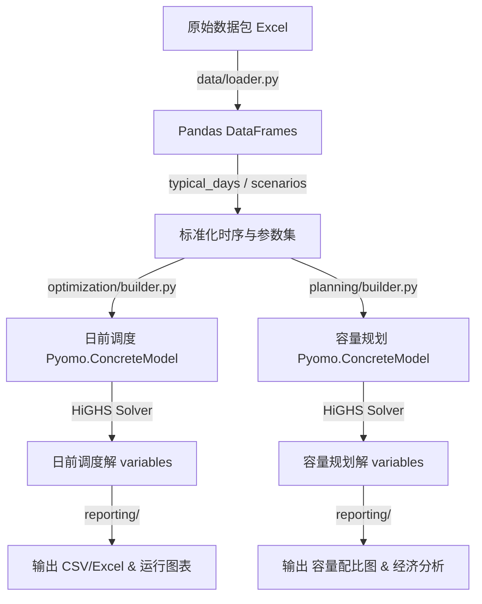

# 零碳园区电-热-氢-储综合能源系统开发指南

本指南旨在为本项目的二次开发、模型拓展、约束调整和算法优化提供系统性的指导。

---

## 一、 项目定位与核心模型

本项目基于鄂尔多斯零碳园区数据包，构建了一个 **24小时日前混合整数线性规划（MILP）优化调度模型** 与 **多典型日联合容量规划模型**。
* **日前优化调度（Operation Scheduling）**：在设备容量固定的前提下，通过精细调控 24 小时内各设备（电网购电、风光出力、电池充放电、电解槽制氢、储氢罐充放、燃料电池发电、热泵制热、燃气锅炉制热）的出力，最小化单日综合运行成本（含能耗、运维、碳排放税及折旧成本）。
* **容量规划（Capacity Planning）**：在多典型日（夏季、冬季、过渡季）和多不确定场景的联合约束下，同时优化系统内风电、光伏、电池、电解槽、储氢罐、燃料电池和热泵的装机容量，最小化系统生命周期的年化总成本（年化 CAPEX + 年运行 OPEX）。

---

## 二、 系统架构与模块职责

整个项目的源码存放在 [src/zero_carbon_park](file:///e:/clean_engry_system/src/zero_carbon_park) 目录下。各个子包的职能划分非常清晰，构成了一个高内聚、低耦合的系统：

### 1. 核心目录树与职责说明

```
src/zero_carbon_park/
├── __init__.py
├── cli.py                    # 命令行入口，统筹调度各个业务逻辑
├── config.py                 # 全局配置管理（输入输出路径、基础常量等）
├── data/                     # 数据加载与前置预处理模块
│   └── loader.py             # 读取原始 Excel 数据包，提取并转换为 Pandas Dataframe
├── models/                   # 日前优化调度模型的核心约束与目标函数定义
│   ├── constraints_carbon.py    # 实时碳核算、碳配额软约束
│   ├── constraints_heat.py      # 热力平衡（热泵、锅炉）与天然气热值转换
│   ├── constraints_hydrogen.py  # 氢气平衡、电解槽分段线性化产氢、储氢罐
│   ├── constraints_power.py     # 电力平衡（风、光、网、电池、燃料电池、热泵耗电）
│   ├── constraints_storage.py   # 电池 SOC 时序演化、充放电互斥与老化成本分段线性化
│   └── objective.py             # 日前调度目标函数（最小化总运行费用）
├── optimization/             # 调度模型的实例组装与求解
│   ├── builder.py            # 根据指定场景配置，将 models/ 中的约束拼装为 Pyomo ConcreteModel
│   └── runner.py             # 调用求解器（HiGHS）执行求解，并提取解
├── planning/                 # 年化容量规划优化模型
│   ├── builder.py            # 构建多典型日联合容量规划模型，注入联合约束
│   ├── cost_params.py        # 规划设备寿命与投资单价，并提供资本回收系数（CRF）计算
│   ├── objective.py          # 容量规划优化目标（年化 CAPEX + 年 OPEX）
│   └── variables.py          # 声明 8 类规划设备的容量决策变量
├── scenarios/                # 场景分析与敏感性参数扰动
│   ├── definition.py         # S0 - S5 的设备启用布尔场景定义
│   └── sensitivity.py        # 峰谷电价、设备投资成本等参数的扰动扫描逻辑
├── typical_days/             # 多典型日抽取与权重天数配置
├── uncertainty/              # 不确定性压力测试场景设置
└── reporting/                # 结果输出与绘图渲染
    ├── excel_report.py       # 将变量求解结果分类汇总并输出为 Excel/CSV 报表
    └── plotting.py           # 绘制能量平衡图、Pareto前沿、敏感度与成本对比图
```

---

## 三、 模型构建与数据流向

系统的数据流向遵循以下标准管道（Pipeline）：



### 1. 建模框架：Pyomo 的运用
项目使用 Pyomo 进行数学建模。模型组装时：
1. 创建 `ConcreteModel` 实例。
2. 注入时间步集合 `model.T = Set(initialize=range(24))`，对于多典型日规划，还会注入天数集合 `model.D`。
3. 将外部读取的参数（如风光出力、电负荷等时序数据）绑定为 Pyomo 的只读参数（`Param`）。
4. 声明各阶段的决策变量（`Var`），并限定其定义域（如 `NonNegativeReals` 或 `Binary`）。
5. 遍历约束函数，使用 `Constraint` 绑定约束规则。
6. 使用 `Objective` 绑定目标函数，最后调用求解器。

---

## 四、 二次开发与功能扩展指南

### 1. 如何增加一个新的设备？
以添加“**冰蓄冷系统（Cold Storage）**”满足园区冷负荷为例：

1. **修改数据层 (`data/loader.py`)**：
   在 Excel 中读取冷负荷时序数据与冰蓄冷设备的技术参数（充冷效率、放冷效率、容量限制）。
2. **编写约束文件 (`models/constraints_cooling.py`)**：
   在 `models/` 目录下新建约束文件，定义冰蓄冷的 SOC 累积约束、充放冷功率限制、冷量平衡约束：
   $$Q_{\text{ch\_cool}, t} + Q_{\text{dis\_cool}, t} \le \dots$$
3. **在日前构建器中绑定 (`optimization/builder.py`)**：
   导入并调用新增的约束绑定函数：
   ```python
   from zero_carbon_park.models.constraints_cooling import add_cooling_constraints
   # 在 build_model 中：
   add_cooling_constraints(model)
   ```
4. **如果该设备需要规划容量，修改规划模块 (`planning/`)**：
   * 在 `planning/variables.py` 中添加冷储能的功率与容量决策变量：`model.cold_storage_capacity = Var(...)`
   * 在 `planning/cost_params.py` 中添加其使用寿命与投资单价。
   * 在 `planning/objective.py` 中将冷储能的年化 CAPEX 累加到总投资成本中。
   * 在 `planning/builder.py` 中将各典型日的日前调度冷约束与冷储能装机决策变量绑定。

### 2. 如何增加一个新的分析维度或场景？
1. **定义场景开关 (`scenarios/definition.py`)**：
   在 `Scenario` 配置类中增加对应的布尔开关或参数（例如 `use_cold_storage`）。
2. **在命令行入口注册 (`cli.py`)**：
   在 ArgumentParser 中注册对应的命令行参数（例如 `--run-cooling`），并在主控逻辑中组装相应的参数并调用 runner。
3. **编写对应的结果绘图方法 (`reporting/plotting.py`)**：
   利用 matplotlib 绘制冷能量平衡图，将结果存放到 `outputs/figures/` 下。

---

## 五、 测试与工程规范

### 1. 本地运行测试
项目拥有非常完善的单元测试与集成测试（目前在 `tests/` 目录下拥有 24 个测试脚本）。
在终端中运行测试：
```powershell
# 运行全部测试
.\engrysystem-env\Scripts\python.exe -m pytest

# 简要模式运行
.\engrysystem-env\Scripts\python.exe -m pytest -q
```

### 2. 编写新测试
当您为系统开发了新约束、新设备或新的数据扰动方案时，必须在 `tests/` 目录下添加测试脚本以保证代码稳定性：
* 模拟微型数据集进行单元测试（如 `test_piecewise_device_performance.py`）。
* 执行小规模的管道测试（如 `test_minimal_milp_scenarios.py`）。
* 确保断言覆盖了新设备的物理平衡边界（如 `SOC <= 容量上限`）。
