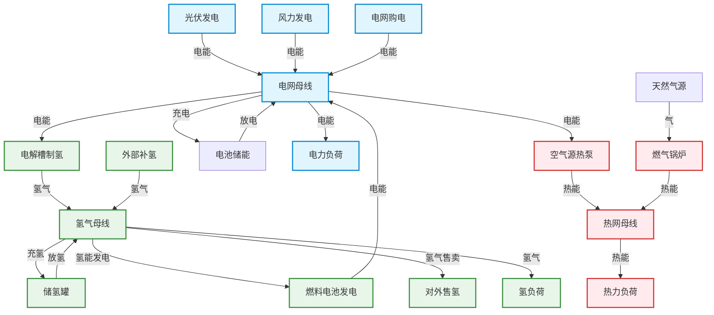

# 鄂尔多斯零碳园区电-热-氢-储综合能源系统优化调度与容量规划
## ―― 能源动力/清洁能源硕士求职与专业知识应用全攻略

本项目基于内蒙古鄂尔多斯零碳工业园区的真实边界条件，构建了一个涵盖“电-热-氢-储”多能流互补的日前优化调度与系统容量规划模型。本学习文档专为**清洁能源技术 / 能源动力**硕士量身定制，**以综合能源系统（IES）与清洁能源应用为主线，以运筹优化算法与建模为副线**，协助你在秋招面试中展现深厚的专业知识和算法落地能力。

---

## 1. 简历项目描述精修模板（综合能源系统视角）

在求职简历中，建议突出你在**多能流协同、低碳经济运行、绿氢应用和能源规划评估**方面的专业深度，结合运筹优化算法实现工程落地。

### 简历填表模板

*   **项目名称**：零碳园区电-热-氢-储综合能源系统优化调度与容量规划
*   **项目角色**：系统设计与能源规划建模工程师 / 综合能源系统算法工程师
*   **核心技术栈**：综合能源系统（IES）建模、电-热-氢-储多能互补、电解水绿氢技术、空气源热泵电热替代、碳审计与碳成本核算、Pyomo、HiGHS 求解器、两阶段随机规划、最坏情形鲁棒优化、Pareto 前沿分析。

### 简历核心描述（直接复制/修改）
1. **[多能流物理拓扑设计]** 针对内蒙古鄂尔多斯零碳园区的多能互补需求，搭建了日前 24 小时“电-热-氢-储”综合能源系统拓扑。精细化建模了风电/光伏出力、电网交互、电化学储能、电解水制氢（EL）、高压储氢罐、质子交换膜燃料电池（FC）、空气源热泵（HP）及燃气锅炉（GB）等 9 类异构设备的物理特性与能量转换效率。
2. **[低碳调度与电热氢替代]** 采用日前混合整数线性规划（MILP）技术，以系统综合能源成本及碳税成本最小化为目标，利用二进制状态变量建模储能充放电互斥以及耦合设备开停机状态，通过“电-氢”、“电-热”深度耦合平抑风光出力波动，减少园区对高碳网电与燃气锅炉燃气消耗的依赖。
3. **[系统容量协同规划]** 提出基于多典型日（夏、冬、过渡季）年化成本的“设备容量-运行调度”联合优化（Co-optimization）模型。通过连续性松弛技巧降低求解维度，联合优化风光装机、储能配比、热泵与氢能链容量，实现全生命周期年化投资成本（CAPEX）与年运行成本（OPEX）的完美平衡。
4. **[碳减排 Pareto 与敏感性评估]** 建立碳排放硬约束，利用 $\varepsilon$-约束法求解“经济成本-碳排放”帕累托（Pareto）前沿，量化低碳减排上限的系统边际成本；评估关键清洁能源技术设备（如电解槽、储氢罐、热泵）的 CAPEX 敏感性，为园区低碳转型规划提供多情景决策支持。
5. **[不确定性防御]** 引入两阶段随机规划与鲁棒优化（Min-Max 框架），解决风光高比例波动性及冷热电氢多元负荷预测误差带来的系统运行风险，保障系统在风光偏低、负荷偏高及极端组合场景下的物理可行性与供能安全。

---

## 2. 综合能源系统（IES）物理架构与能流耦合深度解析

本项目物理本质是一个典型的**微网型多能流综合能源系统（IES, Integrated Energy System）**。它将传统上孤立的电网、气网、热网通过**耦合转化设备**和**储能设备**联系在一起，实现多能协同和时空互补。

### 2.1 关键耦合转换节点
1. **电 $\rightarrow$ 氢转换（电解水制氢, P2H）**：
   *   **设备**：电解槽（Electrolyzer）。在午间光伏大发或夜间谷电时段，电解槽吸收富余绿电，通过电解水化学反应将电能转化为氢能，制备的绿氢进入储氢罐或直供氢负荷。
2. **氢 $\rightarrow$ 电转换（质子交换膜燃料电池, H2P）**：
   *   **设备**：燃料电池（Fuel Cell）。在系统电负荷高峰、无风无光且电网电价高昂时，燃料电池消耗储存的氢能发电，回馈园区电母线，减少外购电。
3. **电 $\rightarrow$ 热转换（空气源热泵, P2H）**：
   *   **设备**：热泵（Heat Pump）。利用逆卡诺循环，消耗少量电能从空气中“搬运”热能供给园区热母线。相比于传统的燃气锅炉（烧气释放二氧化碳），热泵是实现“以电代热/清洁替代”的核心低碳设备。
4. **气 $\rightarrow$ 热转换（传统燃气锅炉）**：
   *   **设备**：燃气锅炉（Gas Boiler）。消耗天然气提供热量，作为热泵的备用和补充出力，属于高碳化石能源终端。

### 2.2 储能系统的时空互补机制
*   **短周期电化学储能（电池, BESS）**：响应速度快、效率高（单向充/放效率约 90-95%），但自放电率存在，且充放电存在循环寿命限制。主要承担系统内的日内电能平移（如午充晚放，赚取峰谷电价差）。
*   **长周期/大容量化学储能（储氢罐, Hydrogen Storage Tank）**：以压缩气体形式存储氢能。由于没有自放电损失且投资成本相对电池更低，适合用作系统级、长周期（跨天或跨季节）的能量缓冲。

---

## 3. 综合能源系统多能流数学建模与物理约束

作为清洁能源专业的学生，你需要向面试官清晰推导以下多能流的守恒定律及设备的物理转化特性。

### 3.1 电力网络平衡与新能源消纳
在任意时刻 $t \in T$，电母线的流入功率必须恒等于流出功率：
$$P_{grid\_buy}(t) + P_{pv\_used}(t) + P_{wind\_used}(t) + P_{battery\_dis}(t) + P_{fc}(t) = P_{load\_e}(t) + P_{hp}(t) + P_{battery\_ch}(t) + P_{el}(t)$$
*   **新能源消纳控制**：
    由于光伏和风电出力受到天气自然条件限制（即可发功率上限 $P_{pv\_avail}(t)$ 和 $P_{wind\_avail}(t)$），实际使用量与弃电量满足：
    $$P_{pv\_used}(t) + P_{pv\_curtail}(t) = P_{pv\_avail}(t)$$
    $$P_{wind\_used}(t) + P_{wind\_curtail}(t) = P_{wind\_avail}(t)$$
    系统新能源消纳率 $\eta_{consumption}$ 核算为：
    $$\eta_{consumption} = \frac{\sum_t (P_{pv\_used}(t) + P_{wind\_used}(t))}{\sum_t (P_{pv\_avail}(t) + P_{wind\_avail}(t))}$$
*   **代码实现**：定义于 [constraints_power.py](file:///e:/clean_engry_system/src/zero_carbon_park/models/constraints_power.py)。

### 3.2 热力网络与热泵/锅炉热力学约束
热母线流量平衡：
$$Q_{hp}(t) + Q_{gb}(t) = Q_{load\_h}(t)$$
*   **空气源热泵（HP）**：其出热量与其耗电功率呈线性关系，系数为制热性能系数（COP）：
    $$Q_{hp}(t) = P_{hp}(t) \cdot COP$$
    $$0 \le P_{hp}(t) \le I_{hp}(t) \cdot P_{hp\_max}, \quad I_{hp}(t) \in \{0, 1\}$$
    *注：在实际工程中，COP 会随环境温度剧烈波动，但在日前调度中通常简化为日均常数（如 3.5）。*
*   **燃气锅炉（GB）**：天然气消耗量 $V_{gas}$（单位：$\text{m}^3/\text{h}$）由锅炉出热量、效率 $\eta_{gb}$ 以及天然气低位热值 $LHV_{gas}$ 决定：
    $$V_{gas}(t) = \frac{Q_{gb}(t)}{\eta_{gb} \cdot LHV_{gas}}$$
    这里 $LHV_{gas}$ 约为 $9.7 \text{ kWh/m}^3$ 左右。锅炉上限约束为：$0 \le Q_{gb}(t) \le Q_{gb\_max}$。
*   **代码实现**：定义于 [constraints_heat.py](file:///e:/clean_engry_system/src/zero_carbon_park/models/constraints_heat.py)。

### 3.3 氢能系统网络平衡与储能动态
氢气质量流平衡（单位：$\text{kg/h}$）：
$$m_{h2\_prod}(t) + m_{h2\_dis}(t) + m_{h2\_ext}(t) = m_{load\_h2}(t) + m_{h2\_ch}(t) + m_{h2\_sale}(t) + m_{h2\_fc}(t)$$
*   **电解槽制氢（EL）**：耗电功率与其产氢量的关系由单位制氢耗电量 $e_{el\_cons}$ 决定：
    $$m_{h2\_prod}(t) = \frac{P_{el}(t)}{e_{el\_cons}}$$
    *注：常数 $e_{el\_cons}$ 表示每制备 1 kg 氢气消耗的电能，通常碱性电解槽为 50-55 $\text{kWh/kg H}_2$，PEM 电解槽为 55-60 $\text{kWh/kg H}_2$。*
*   **氢燃料电池（FC）**：发电功率与其耗氢量的关系由单位氢气发电量 $e_{fc\_gen}$ 决定：
    $$P_{fc}(t) = m_{h2\_fc}(t) \cdot e_{fc\_gen}$$
    *注：若燃料电池电能转化效率为 50%，则 $e_{fc\_gen}$ 约为 $16.5 \text{ kWh/kg H}_2$（基于氢气低位发热量约 33.3 kWh/kg）。*
*   **储氢罐（H2 Storage）**：采用一阶差分状态方程表征储氢罐内氢气质量守恒关系：
    $$S_{h2}(t) = S_{h2}(t-1) + m_{h2\_ch}(t) - m_{h2\_dis}(t)$$
    $$S_{h2\_min} \le S_{h2}(t) \le S_{h2\_capacity}$$
    在优化终点有闭环约束：$S_{h2}(T) = S_{h2\_initial}$，保证日内能量无净增减。
*   **代码实现**：定义于 [constraints_hydrogen.py](file:///e:/clean_engry_system/src/zero_carbon_park/models/constraints_hydrogen.py)。

### 3.4 电池储能系统（BESS）电量状态（SOC）
电池 SOC 的本质是电量积分方程。为了体现电池充放电的非理想损失，引入充电效率 $\eta_{ch}$ 和放电效率 $\eta_{dis}$：
$$E_{bat}(t) = E_{bat}(t-1) + P_{bat\_ch}(t) \cdot \eta_{ch} - \frac{P_{bat\_dis}(t)}{\eta_{dis}}$$
$$E_{bat\_min} \le E_{bat}(t) \le E_{bat\_capacity}$$
为了避免算法将电池“空手套白狼”地榨干，添加末端约束：$E_{bat}(T) = E_{bat\_initial}$。
同时，利用二进制决策变量限制充放电互斥：
$$I_{bat\_ch}(t) + I_{bat\_dis}(t) \le 1, \quad I_{bat\_ch}(t), I_{bat\_dis}(t) \in \{0, 1\}$$
$$P_{bat\_ch}(t) \le I_{bat\_ch}(t) \cdot P_{bat\_max}$$
$$P_{bat\_dis}(t) \le I_{bat\_dis}(t) \cdot P_{bat\_max}$$
*   **代码实现**：定义于 [constraints_storage.py](file:///e:/clean_engry_system/src/zero_carbon_park/models/constraints_storage.py)。

---

## 4. 综合能源系统低碳运行指标与碳审计核算

零碳园区运行的指挥棒是**碳减排效益与经济性的权衡**。本项目建立了严密的碳审计与评价指标体系。

### 4.1 碳排放核算源
本系统涉及两类碳排放源：
1. **直接排放（Scope 1）**：园区内燃气锅炉燃烧天然气释放的温室气体。
   $$Carbon_{direct}(t) = V_{gas}(t) \cdot EF_{gas}$$
   *注：天然气碳排放因子 $EF_{gas}$ 典型值为 $1.88-2.1 \text{ kg CO}_2/\text{m}^3$。*
2. **间接排放（Scope 2）**：园区向外部大电网外购电能所带来的上游火力发电间接碳排放。
   $$Carbon_{indirect}(t) = P_{grid\_buy}(t) \cdot EF_{grid}(t)$$
   *注：电网碳排放因子 $EF_{grid}(t)$ 具有明显的动态性。例如白天光伏发电多，电网碳排放强度下降；夜间主要是火电提供基荷，电网碳强度上升。本系统支持小时级动态碳因子输入。*
3. **系统总碳排放**：
   $$Carbon_{total} = \sum_t \left( Carbon_{direct}(t) + Carbon_{indirect}(t) \right)$$
*   **代码实现**：定义于 [constraints_carbon.py](file:///e:/clean_engry_system/src/zero_carbon_park/models/constraints_carbon.py)。

### 4.2 清洁能源系统关键评价指标
面试时，用这些专业指标能立刻体现你的硕士专业素养：
1. **单位供能碳强度（Carbon Intensity of Energy Supply）**：
   $$CI_{ies} = \frac{Carbon_{total}}{E_{load\_total} + Q_{load\_total} + m_{load\_h2\_total} \cdot LHV_{h2}} \quad [\text{kg CO}_2/\text{kWh\_energy}]$$
   反映整个园区单位复合能量消耗所产生的碳排放。
2. **平准化制氢成本（LCOH, Levelized Cost of Hydrogen）**：
   在容量规划模型中，核算电解槽、储氢罐投资 CAPEX 均摊与电费运行费 OPEX，除以年总制氢量：
   $$LCOH = \frac{Annualized\_CAPEX_{hydrogen\_chain} + OPEX_{el\_power}}{\sum m_{h2\_prod}} \quad [\text{元/kg H}_2]$$
3. **避碳边际成本（MAC, Marginal Abatement Cost）**：
   当通过限制碳配额（Pareto 分析）使碳排放从 $Carbon_{A}$ 降到 $Carbon_{B}$，系统总成本从 $Cost_{A}$ 上升到 $Cost_{B}$，避碳边际成本为：
   $$MAC = \frac{Cost_{B} - Cost_{A}}{Carbon_{A} - Carbon_{B}} \quad [\text{元/t CO}_2]$$
   该指标能说明系统为了减少一吨碳排放需要额外付出多少经济代价。

---

## 5. 运筹优化算法在能源系统中的应用

虽然你是能源技术专业，但在面试综合能源岗时，**“算法落地与数学建模”** 是你的核心竞争优势。你需要讲透优化算法是如何为能源系统服务的。

### 5.1 资本回收系数（CRF）在容量年化投资中的作用
设备投资属于一次性固定资本支出（CAPEX，元），而调度运行费用是逐年循环发生的流动资金（OPEX，元/年）。为了解决两者时间尺度不一致的问题，必须进行年化均摊。
项目引入**资本回收系数（CRF, Capital Recovery Factor）**：
$$CRF = \frac{r(1+r)^N}{(1+r)^N - 1}$$
其中 $r$ 为年折现率（取 8%），$N$ 为设备使用寿命。设备年折旧投资成本为：
$$Annualized\_CAPEX = CAPEX_{initial} \cdot CRF$$
系统总优化目标函数为：
$$\min \left( \sum_{device} Annualized\_CAPEX_{device} + \sum_{d \in D} w_d \cdot OPEX_d \right)$$
其中 $w_d$ 为典型日 $d$ 的年化加权天数（如夏季 90 天，冬季 120 天，过渡季 155 天）。
*   **代码实现**：在 [planning/cost_params.py](file:///e:/clean_engry_system/src/zero_carbon_park/planning/cost_params.py#L30-L38) 及 [planning/objective.py](file:///e:/clean_engry_system/src/zero_carbon_park/planning/objective.py) 中实现。

### 5.2 大规模容量规划中的连续性松弛（Continuous Relaxation）
*   **物理矛盾**：在日前调度（MILP）中，为了防止电池“自买自卖”或限制热泵开停机状态，必须引入 0/1 整数变量。然而，在全年的容量规划中，如果对每个小时（8760 小时，或 3 个典型日 × 24 小时）都引入整数变量，求解规模将遭遇严重的“维度灾难”，求解器可能几小时都无法收敛。
*   **算法解决**：在容量规划代码中（[planning/constraints.py](file:///e:/clean_engry_system/src/zero_carbon_park/planning/constraints.py)），我们去除了充放电互斥二进制约束，松弛为连续变量。由于系统内存在充放电损耗（$\eta_{ch} \cdot \eta_{dis} < 1$），只要系统以最小化成本为目标，**优化结果就会自发避免“又充又放”的非物理行为**，自动保证了最优解的物理合理性。这一步松弛将容量规划降维为了纯线性规划（LP），使得原本庞大的联合优化问题在**秒级**内完成求解。

### 5.3 Pareto 多目标折中（$\varepsilon$-约束法）
系统成本与碳排放往往是冲突的（碳税高逼迫多买高价绿电设备，成本上升）。我们采用 $\varepsilon$-约束法，将碳排放总量作为约束上界：
$$\sum_{d,t} w_d \cdot Carbon(d,t) \le \varepsilon$$
改变 $\varepsilon$ 的上限阈值，多次调用 LP 求解器，获得了一组边界最优解集（帕累托前沿），为规划决策提供了清晰的成本-碳排放权衡分析。
*   **代码实现**：定义于 [planning/pareto.py](file:///e:/clean_engry_system/src/zero_carbon_park/planning/pareto.py)。

### 5.4 两阶段随机容量规划（Stochastic Programming）
解决日前预测误差（风光出力偏低、负荷偏高）对容量规划的影响。
*   **第一阶段决策（Stage-1）**：设备安装容量（投资决策），这是不确定性发生前需要确定的“硬资产”，所有情景共享。
*   **第二阶段决策（Stage-2）**：各场景下的日运行变量（购电、充放电、产氢等），属于针对具体天气和负荷波动的“追补运行调度”。
*   **目标**：在 18 个“典型日 × 不确定场景”组合概率下，最小化系统期望年总成本：
    $$\min \left( Annualized\_CAPEX(Cap) + \sum_{s \in S} P_s \cdot OPEX_s(Cap, Op_s) \right)$$
*   **代码实现**：定义于 [stochastic_planning.py](file:///e:/clean_engry_system/src/zero_carbon_park/uncertainty/stochastic_planning.py)。

### 5.5 最坏情形鲁棒容量规划（Robust Optimization）
如果某些罕见工况（如极寒无风无光无绿电）发生概率极低，但发生时系统崩溃的惩罚极大，就必须进行鲁棒容量设计（Min-Max 极大极小架构）：
$$\min_{Cap} \left\{ Annualized\_CAPEX(Cap) + \max_{u \in U} OPEX_u(Cap, Op_u) \right\}$$
在 Pyomo 中，通过引入实数辅助变量 $\theta = \max OPEX_u$ 并建立约束 $\theta \ge OPEX_u$ 来实现这一 Min-Max 鲁棒数学结构。
*   **代码实现**：定义于 [robust_planning.py](file:///e:/clean_engry_system/src/zero_carbon_park/uncertainty/robust_planning.py)。

---

## 6. 综合能源系统求职面试高频专业提问与完美回答

这里汇总了面试中针对**清洁能源系统应用**的硬核提问。

### 6.1 专业应用与业务提问

#### Q1：在鄂尔多斯零碳园区中，为什么要同时配置电池储能（BESS）和制氢储氢系统？两者在多能流系统中有什么功能性区别？
*   **完美回答**：
    两者在时间尺度、能量密度和应用场景上构成了完美的互补：
    1. **时间尺度与响应速度**：电池储能响应速度为毫秒级，循环效率高（$\ge 90\%$），但存在自放电，适合用于**日内短周期、高频次**的电能平移和调频辅助服务。制氢储氢由于储氢罐无自放电损失，适合作为**长周期、大容量（跨天、跨周甚至跨季节）**的能量缓冲，可以有效应对持续数天的无风无光极端气候。
    2. **能流耦合度**：电池储能仅限于电网内部（电 $\rightarrow$ 电）。而制氢储氢系统（P2H2P）是连接电网与园区工业氢负荷（如氢冶金、重卡燃料电池等）的桥梁，使电能能够延伸到化工和重工业脱碳领域，拓宽了新能源消纳路径。

#### Q2：在实际工程中，空气源热泵的 COP 是随温度剧烈变化的，你的日前调度模型如何逼近热泵非线性特征？
*   **完美回答**：
    在模型中我们暂时将其简化为日均常数以保持线性特性。在更精细的物理建模中，热泵的 COP 是室外温度 $T_{out}$ 和供水温度 $T_{water}$ 的非线性函数。我们一般采用以下两种方式处理：
    1. **分段线性化（PWL, Piecewise Linearization）**：根据气象日前温度预测曲线，将一天的 24 小时划分为数个温度平稳区间，每个区间内 COP 取对应的常数，保持约束依旧为线性。
    2. **混合整数多项式逼近**：利用日前预测温度提前计算好 24 小时每个小时对应的 $COP(t)$ 数组，直接作为模型参数（Param）输入。因为日前调度中温度曲线在求解前已经是确定的已知时间序列，因此虽然 $COP(t)$ 随时间变化，但在 Pyomo 中它仍然是一个**参数**而非**决策变量**，模型约束依然保持完全线性，不需要引入复杂的非线性求解器。

#### Q3：在低碳调度（S5）中，碳排放因子 $EF_{grid}(t)$ 如果是动态的小时级碳因子，和传统的年均碳排放因子相比，对系统调度会产生什么影响？
*   **完美回答**：
    年均碳因子是一个死板的常数，无法反映电网在不同时刻的真实清洁度。而动态小时级碳因子能实时反映大电网的碳强度。
    - **当使用动态碳因子时**：大电网在午间（光伏大发）或深夜（风电大发）碳因子较低，在早晚高峰（火电出力多）碳因子极高。
    - **系统调度响应**：碳税成本注入后，系统在电网碳因子高的时段，会倾向于利用本地燃料电池发电，或者通过电池释放绿电；在电网碳因子低（大电网清洁）的时段，会增加购电用于电池充电或电解水制氢。动态碳因子能够引导综合能源系统进行**“碳源主动响应”**，实现更深度的协同去碳。

---

### 6.2 运筹优化与建模提问

#### Q4：在容量规划中，你把日前调度中的二进制变量松弛为了连续变量，请问在什么特殊工况下，这个松弛会失效，导致系统出现“既充电又放电”的物理穿透？
*   **完美回答**：
    当系统内的**过剩绿电极度充裕**（即弃风弃光极高），且**弃电惩罚为 0**，同时**储能的充电和放电效率均为 100%** 时，由于没有任何成本和能量损耗阻碍，求解器可能会给出同时充放电的冗余解。
    但在实际系统中，因为存在 $\eta_{ch} \cdot \eta_{dis} < 100\%$ 的物理损耗，同时充放电会造成电能净损失，增加系统成本。由于我们的目标函数是最小化总成本，求解器在寻优时会自动避免这种带来额外电能损耗的行为。因此在绝大多数有损耗和成本导向的物理模型中，连续松弛依然能够得出物理合理的真实调度方案。

#### Q5：如何理解两阶段随机规划与鲁棒优化在解决“不确定性”时的本质区别？在园区规划中，你会如何向业主推荐这两种方案？
*   **完美回答**：
    两者的哲学逻辑和抵御风险的边界截然不同：
    1. **随机规划（Stochastic Programming）** 侧重于**“期望值最优”**。它假设我们可以预知未来场景发生的概率，目标是让系统在大部分高概率场景下的**平均运行成本最低**。其结果较温和，但如果发生极低概率的灾难场景，系统可能由于备用容量不足而面临天价外部惩罚。
    2. **鲁棒优化（Robust Optimization）** 侧重于**“防御最坏情形”**（保守性强）。它不关心场景概率，只确保配置方案在哪怕最恶劣的工况下，系统依然能无故障运行，且控制最坏情况下的最大年度成本。
    **推荐建议**：
    - 如果园区预算有限，希望追求**投资性价比与平均收益最大化**，推荐**随机容量规划**。
    - 如果园区是医院、精密制造厂或国防核心重工业区，对**供能中断或设备缺氢故障零容忍**，且不计较适度的初期投资溢价，则强烈推荐**最坏情形鲁棒配置方案**。

---

## 7. 模块索引与代码地图

以下是该项目核心源码的文件路径索引，便于你在复习时快速查阅物理建模的具体代码实现：

*   **日前调度与物理平衡**：
    - 电网/风光/负荷电力守恒：[constraints_power.py](file:///e:/clean_engry_system/src/zero_carbon_park/models/constraints_power.py)
    - 热泵/锅炉热平衡与天然气消耗：[constraints_heat.py](file:///e:/clean_engry_system/src/zero_carbon_park/models/constraints_heat.py)
    - 电解槽/燃料电池/储氢罐氢能平衡：[constraints_hydrogen.py](file:///e:/clean_engry_system/src/zero_carbon_park/models/constraints_hydrogen.py)
    - 电池 SOC 守恒与日前充放电状态互斥：[constraints_storage.py](file:///e:/clean_engry_system/src/zero_carbon_park/models/constraints_storage.py)
    - 动态碳因子与碳税审计：[constraints_carbon.py](file:///e:/clean_engry_system/src/zero_carbon_park/models/constraints_carbon.py)
*   **容量规划与多典型日年化**：
    - 容量规划总装配（无开停机松弛）：[planning/constraints.py](file:///e:/clean_engry_system/src/zero_carbon_park/planning/constraints.py)
    - 资本回收系数（CRF）与年化计算逻辑：[planning/cost_params.py](file:///e:/clean_engry_system/src/zero_carbon_park/planning/cost_params.py)
    - 多目标 Pareto 前沿求解算法：[planning/pareto.py](file:///e:/clean_engry_system/src/zero_carbon_park/planning/pareto.py)
*   **不确定性研究与防御算法**：
    - 多场景两阶段期望值随机规划：[stochastic_planning.py](file:///e:/clean_engry_system/src/zero_carbon_park/uncertainty/stochastic_planning.py)
    - 两阶段最坏情形鲁棒优化：[robust_planning.py](file:///e:/clean_engry_system/src/zero_carbon_park/uncertainty/robust_planning.py)
